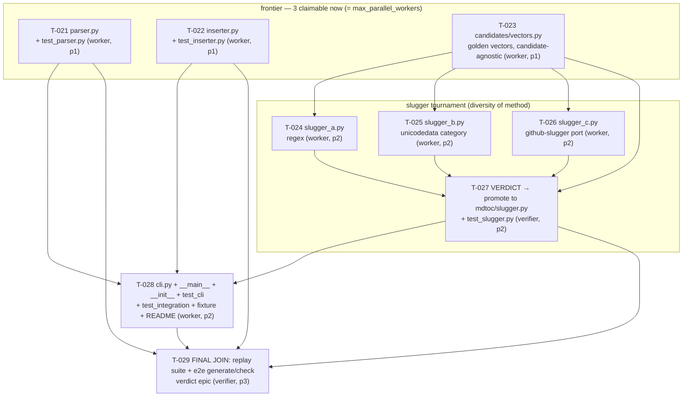
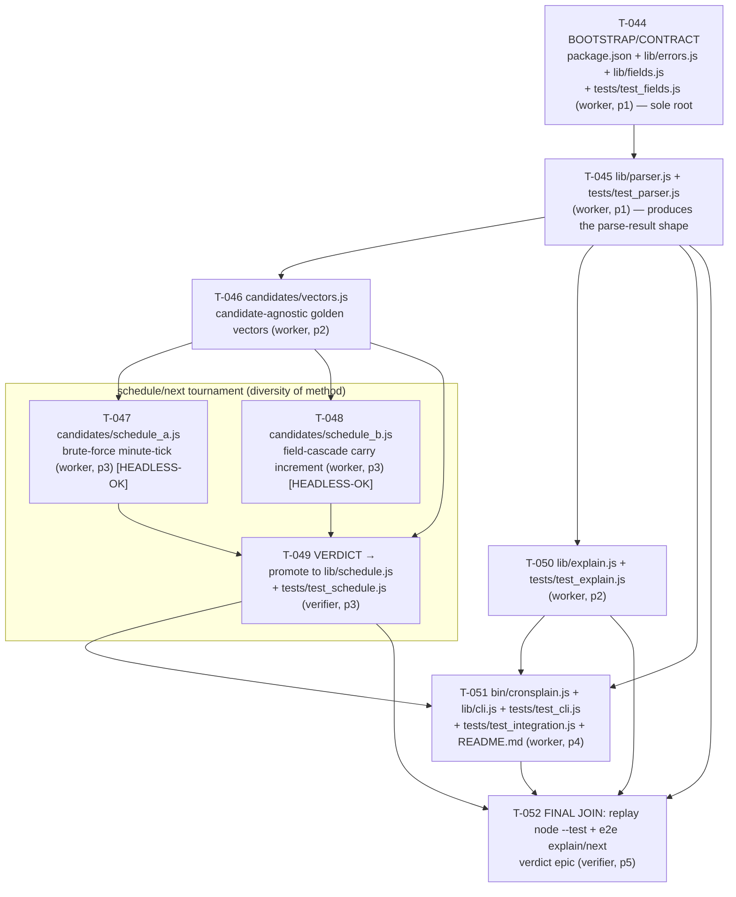

# Harness Build Plan (maintained by Thinkers; workers execute, verifiers gate)

> Owner: orchestration-planner / fable-5-coordinator.
> Rule: this file states WHY and IN WHAT ORDER; the blackboard states WHO and WHAT NOW.
> Lock this file (`lock.py acquire .harness/plan.md --holder <you>`) before rewriting it.

## Generation 0 — Substrate (DONE, this session)
Physical runtime substrate per claude.md §4 / gemini.md §4: guarded blackboard,
TTL write locks, JSONL observability (hook-fed), deterministic CLIs, agent bench,
Gemini prompt bridge, git baseline.

## Generation 0 → 1 — Frontier (parallel where independent)
- **T-002** Gemini contract test (bridge file: `prompts para Gemini/1.md`) — proves NLAH portability, feeds friction notes to the audit.
- **T-003** AST semantic indexer v0 — ZCode parity item #3.
- **T-004** Goal-mode runner v0 — ZCode parity item #1.
- **T-005** Remote messenger hook v0 — ZCode parity item #2 (human-gated activation).

## Generation 1 — Evolution loop (cascade: real dependency on evidence)
- **T-006** Audit trajectories from logs (claude.md §5A steps 1–2) — needs T-002/T-003/T-004 evidence to exist.
- **T-007** Gated mutation of claude.md/gemini.md (§5A steps 3–4) — needs T-006 verdicts; bumps `harness_generation`; git commit "generation 1".

## mdtoc (external real-use proof)

### Why
The harness has so far only built itself. **mdtoc** — a Markdown table-of-contents
CLI (`projects/mdtoc/`, Python 3.9+ stdlib only, matching repo culture) — is the first
*external* deliverable: it proves the full topology end-to-end (planner → parallel
workers → tournament → verifier join) on real product code the harness does not own.
Success = a green test suite + an idempotent end-to-end `generate`/`check` run, produced
by independent agents under disjoint file ownership, with the slugger chosen by a real
tournament rather than a single fragile guess.

### The DAG (T-021 … T-029, epic `mdtoc`, engine `claude`)

### Every edge is a real artifact-consumption (no false cascade)
- `T-023 → T-024/025/026` — each candidate imports `vectors.py` (shared interface + golden data) to self-check. Candidates have NO edges to each other.
- `T-023,T-024,T-025,T-026 → T-027` — the verdict literally runs `vectors.run_against` over all three candidate implementations to score them.
- `T-021,T-022,T-027 → T-028` — the CLI imports `parse_headings` (T-021), `render_toc`/`insert_toc` (T-022), and the *promoted* `slugify` (T-027). It depends on the **verdict, never on the candidates** (requirement 3).
- `T-021,T-022,T-027,T-028 → T-029` — the final join replays `test_parser` (T-021), `test_inserter` (T-022), `test_slugger`+`slugger.py` (T-027), and `test_cli`+`test_integration`+fixture+`mdtoc -m` (T-028). These four leaves transitively close over the whole DAG (T-028→T-027→{T-023,24,25,26}), so "everything must be done" is enforced **without** a false edge to the superseded candidate files.
- **No edges** between parser, inserter, and the slugger track: they are the independent frontier. The inserter takes `slugify` by **dependency injection** (a callable arg) so it never imports the slugger — that is what keeps it on the frontier with zero edge to the tournament.

### Disjoint file ownership (mechanical parallel safety)
No file appears in two tasks, so any concurrent subset is collision-free:
`parser.py`+`test_parser.py` (T-021) · `inserter.py`+`test_inserter.py` (T-022) ·
`candidates/vectors.py` (T-023) · `candidates/slugger_a.py` (T-024) ·
`candidates/slugger_b.py` (T-025) · `candidates/slugger_c.py` (T-026) ·
`mdtoc/slugger.py`+`test_slugger.py` (T-027) ·
`cli.py`+`__main__.py`+`__init__.py`+`test_cli.py`+`test_integration.py`+`fixtures/sample.md`+`README.md` (T-028) ·
T-029 owns nothing (replay-only). `__init__.py` is created solely by T-028; frontier
tests import `mdtoc` as a PEP-420 namespace package via a `sys.path` insert, so they run
before the package marker exists.

### Tournament rationale (the harness's first tournament)
GitHub anchor slugging is the one high-uncertainty node here (unicode word classes,
emoji, punctuation tables, per-document dedup) — exactly the case ORCHESTRATION.md §5
reserves for tournament/consensus. So instead of one fragile guess we run **three
method-diverse candidates against one candidate-agnostic golden test-vector file**:
- T-024 **regex-based** (`re` word-char class),
- T-025 **unicodedata category-based** (classify via `unicodedata.category`),
- T-026 **github-slugger spec-port** (port the upstream punctuation/emoji rules).

`vectors.py` (T-023) is authored **first** and imports no candidate; it fixes the
interface `slugify(text, seen) -> str` and the ground-truth cases (lowercasing,
punctuation strip, unicode retention, emoji removal, underscores, dedup `-1/-2`).
The verdict (T-027, verifier role) scores all three with `vectors.run_against`, picks by
pass-rate-then-clarity, and **promotes the winner to `mdtoc/slugger.py`** (copy + cite).
Producer ≠ approver holds: T-027 produces `slugger.py`; a different agent verdicts it,
and T-029 re-runs `test_slugger.py` against the promoted file.

### Worker-dispatch order (coordinator running max 3 parallel workers)
1. **Wave 1 (3 parallel):** T-021, T-022, T-023 — the whole frontier. Claim all three at
   once (this keeps the claimable set = 3; if T-023 finished while T-021/T-022 sat
   unclaimed, the candidates would open and the frontier could exceed 3).
2. **Verify wave 1** (verifier role marks T-021/T-022/T-023 done). Finishing T-023 opens
   the tournament.
3. **Wave 2 (3 parallel):** T-024, T-025, T-026 — the candidates (T-021/T-022 already done).
4. **Wave 3 (1, verifier):** T-027 — score + promote winner to `mdtoc/slugger.py`.
5. **Wave 4 (1, worker):** T-028 — CLI + package + integration test + fixture + README.
6. **Wave 5 (1, verifier):** T-029 — replay full suite + e2e; verdict the epic.

### Engine routing
All nine tasks are `--engine claude`: code architecture, spec judgment, and a
consensus verdict — no million-token digestion, heavy numeric math, or plotting, so
nothing is bridged to Gemini for this epic.

## cronsplain (external real-use proof #2 — NON-Python, Node.js)  [PUBLISHED 2026-07-05 — T-044..T-052 LIVE on the board]

> STATUS: **PHASE 2 PUBLISHED 2026-07-05.** All 4 BLOCKING known-unknowns (Q1–Q4) were
> answered by fable-5-coordinator (delegated operator authority; operator veto until ship)
> and recorded in the `## Unknowns` Confirmation lines — every planner default ACCEPTED as
> written. Tasks T-044..T-052 were then published via `blackboard.py add-task`; acceptance
> criteria filled in each `.harness/tasks/T-04x/05x.json`. T-043 is handed to a verifier as
> the phase-2 gate. (Phase 1 = interview-only; the DAG below was a DRAFT until Q1–Q4 closed.)

### Why
The harness has proven itself on itself and on one Python deliverable (mdtoc). **cronsplain**
— a Node.js CLI (`projects/cronsplain/`, node v24, `node:test` built-in runner, ZERO npm
dependencies) — is the second external deliverable and closes readiness criteria 3 (a
**non-Python** repo, source untouched, full epic end-to-end) and 4 (U1–U4 exercised for
real). Goal: parse standard 5-field cron expressions and expose two commands —
`explain <expr>` → human-readable English, and `next <expr> [--from ISO] [--count N]` →
next N occurrences in UTC — with the classic day-of-month OR day-of-week quirk correct and
clean (stack-trace-free) errors on invalid input.

### Key NON-Python fact that reshapes bootstrap ownership (F1)
`node --test` discovers tests by filename glob (`**/*.test.js`, `**/test/**/*.js`, etc.) and
needs **NO package-marker file** — there is no `tests/__init__.py`-class artifact here (the
exact friction the mdtoc epic raced, audit_gen3 P-013/F1). The analogous shared-infra file
in Node is **`package.json`** (it fixes the module system CommonJS-vs-ESM, the `test`
script, `bin`, and `engines`). Every `.js` file must agree on `require` vs `import` BEFORE
parallel workers write them, so the module-system decision is a true shared contract
(BLOCKING Q4, CONFIRMED CommonJS) and `package.json` is owned by exactly ONE task (T-044, root).

### The DAG (T-044 … T-052, epic `cronsplain`, engine `claude`) — PUBLISHED

### Every edge is a real artifact-consumption (no false cascade)
- `T-044 → T-045` — parser `require`s `lib/errors.js` (throws `CronParseError`) and
  `lib/fields.js` (field order, bounds, JAN-DEC/SUN-SAT name maps). Real consumption.
- `T-045 → T-046` — `vectors.js` calls the real `parser` to build the `parsed` inputs it
  feeds candidates (it imports the PARSER, never a candidate). Real consumption.
- `T-045 → T-050` — `explain.js` renders English from the parser's output; its tests parse
  real expressions then assert the sentence. Real consumption.
- `T-046 → T-047` / `T-046 → T-048` — each schedule candidate `require`s `vectors.js` to
  self-check against the fixed interface + golden cases. Candidates have NO edge to each
  other (T-047 ⟂ T-048) — this pair is the deliberate concurrency slot for the swarm smoke.
- `T-046,T-047,T-048 → T-049` — the verdict runs the `vectors.js` harness over both
  candidate implementations to score them, then promotes the winner to `lib/schedule.js`.
- `T-045 → T-051` — the CLI `require`s `parser` (to parse then dispatch) and catches
  `CronParseError` for clean messages. Real consumption.
- `T-050 → T-051` — the CLI `explain` command calls `explain.js`. Real consumption.
- `T-049 → T-051` — the CLI `next` command calls the **promoted `lib/schedule.js`**; it
  depends on the VERDICT, never on a candidate (mirrors the mdtoc requirement). Real.
- `T-045,T-049,T-050,T-051 → T-052` — the final join replays `test_parser`,
  `test_schedule`+`schedule.js`, `test_explain`, and `test_cli`+`test_integration`+e2e CLI.
  These four leaves transitively close over the whole DAG (T-051→T-049→{T-046,47,48}→T-045
  →T-044), so "everything done" is enforced without a false edge to the superseded candidates.
- **No edge** T-050 → the schedule track: `explain` depends only on the parser, so it runs
  in parallel with the tournament (the independent frontier of wave 3).

### Disjoint file ownership (mechanical parallel safety)
No file appears in two tasks, so any concurrent subset is collision-free:
- T-044: `package.json` · `lib/errors.js` · `lib/fields.js` · `tests/test_fields.js`
- T-045: `lib/parser.js` · `tests/test_parser.js`
- T-046: `candidates/vectors.js`
- T-047: `candidates/schedule_a.js`
- T-048: `candidates/schedule_b.js`
- T-049: `lib/schedule.js` · `tests/test_schedule.js` (promoted winner + its test)
- T-050: `lib/explain.js` · `tests/test_explain.js`
- T-051: `bin/cronsplain.js` · `lib/cli.js` · `tests/test_cli.js` · `tests/test_integration.js` · `README.md`
- T-052: owns nothing (replay-only join).

**Bootstrap/infra ownership (F1):** the only shared-infra files — `package.json`,
`lib/errors.js`, `lib/fields.js` — are owned SOLELY by T-044 (the root), and every other
task transitively depends on T-044, so no sibling can race them. There is NO
`tests/__init__.py`-class package marker in Node (see the NON-Python fact above), so the
mdtoc race cannot recur here.

### Headless-claimable task (readiness criterion 2 — swarm smoke)
**T-047 and T-048 (the two schedule candidates) are shaped for a HEADLESS second session**
(`claude -p`, cross-session identity, no in-session registration). Each is fully specified
by (a) its own task description + acceptance criteria and (b) `candidates/vectors.js`
(T-046), which fixes the interface `nextOccurrences(parsed, fromDate, count) -> Date[]` and
the golden ground-truth as a FILE — so a headless agent reads vectors.js, implements its
`schedule_?.js` to pass those vectors, and hands off with ZERO conversational context.
Their JSONs (`.harness/tasks/T-047.json`, `T-048.json`) carry the FULL interface contract,
the parsed-shape note, the self-check command, and the cross-session identity convention
(export `CLAUDE_HARNESS_AGENT_ID` or pass `--agent`/`--holder`; do NOT `session.py register`
— cross-session holders must stay mechanically blocked for others; that invariant is under
test). Because T-047 ⟂ T-048 share no file and both depend only on T-046, two concurrent
sessions (one headless) can claim them at the same time — this pair IS the swarm-smoke slot.

### Tournament rationale (the high-uncertainty node)
The `next`-occurrence computation is the one genuinely fragile node: the DOM/DOW OR quirk,
minute→hour→day→month→year rollover, leap-Feb-29, step edges, and `--from` exclusivity all
compound. Per ORCHESTRATION.md §5 that is exactly the tournament/consensus case. Two
method-diverse candidates against one candidate-agnostic golden-vector file:
- T-047 **brute-force minute-tick**: from `--from`, advance one minute at a time and test
  each minute against the field matchers (simple, obviously-correct, bounded iteration cap).
- T-048 **field-cascade carry increment**: compute the next matching minute, carry into
  hour/day/month with rollover (faster, trickier — the diversity payoff).
`vectors.js` (T-046) is authored first, imports the parser (not a candidate), and the
verdict (T-049, verifier role) scores both with the vectors harness and promotes the winner
to `lib/schedule.js`. Producer ≠ approver holds: T-049 produces `schedule.js`; a DIFFERENT
agent verdicts T-049, and T-052 re-runs `test_schedule.js` against the promoted file.

### Verifier rotation (F6)
T-049 (schedule verdict) and T-052 (epic final join) MUST be verdicted by reviewer
identities distinct from every producer in the epic AND from each other — no sole approver
across the epic (ORCHESTRATION.md §4, the mdtoc single-`harness-verifier` counter-example).

### Worker-dispatch order (coordinator running max 3 parallel workers) — PHASE 2 PUBLISHED
1. **Wave 1 (1):** T-044 bootstrap/contract (sole root — module system + shared infra).
2. **Wave 2 (1):** T-045 parser (only consumer of just T-044; it is the parse-result source).
3. **Wave 3 (2 parallel):** T-046 vectors + T-050 explain (both depend only on T-045).
4. **Wave 4 (≤3 parallel):** T-047 + T-048 candidates (depend on T-046); T-050 explain may
   still be finishing in parallel — at most 3 concurrent, within `max_parallel_workers`.
   This is the swarm-smoke wave (candidates claimable by concurrent/headless sessions).
5. **Wave 5 (1, verifier):** T-049 verdict → promote winner to `lib/schedule.js`.
6. **Wave 6 (1, worker):** T-051 CLI + integration + README.
7. **Wave 7 (1, verifier):** T-052 final join — replay `node --test` + e2e; verdict the epic.

### Engine routing
All nine tasks are `--engine claude`: parser grammar judgment, English rendering, a
consensus verdict, and CLI architecture. The `next` math is light integer/date arithmetic
(not million-token digestion, not heavy numeric/plotting), so **nothing is bridged to
Gemini** for this epic.

## Unknowns — Epic: `cronsplain` (populated per orchestration-planner.md steps 5-6, U1+U3)

> Populated BEFORE the DAG was published. All 4 BLOCKING known-unknowns were posed as numbered
> questions to the coordinator/human (route (b)) and ANSWERED 2026-07-05 (see Confirmation
> lines below) — every default ACCEPTED. The DAG (T-044..T-052) is now PUBLISHED. (Route (a)
> spike tasks were rejected: these are spec/semantic decisions the operator holds, not facts a
> probe task can discover.)

**Known knowns** (verified this session):
- Runtime present: `node v24.15.0`, `npm 11.12.1`; `node:test` is built in (no dependency).
- `node --test` discovers tests by filename glob and needs NO package-marker file — there is
  NO `tests/__init__.py`-class artifact in this epic (contrast mdtoc; audit_gen3 P-013/F1).
- Spec-fixed scope: 5 fields (minute, hour, day-of-month, month, day-of-week); syntaxes
  values, ranges `a-b`, steps `*/n` and `a-b/n`, lists `a,b,c`, names JAN-DEC/SUN-SAT,
  wildcard `*`; commands `explain` and `next`; output in UTC; zero npm dependencies.
- `projects/cronsplain/` does not yet exist; the harness must not touch any other project's source.

**Known unknowns** (each classified BLOCKING / NON-BLOCKING; all 4 BLOCKING now CLOSED):
- **Q1 [BLOCKING → CLOSED] Exact accepted grammar boundary.** Are Vixie extensions IN or OUT —
  `@daily`/`@hourly`/`@reboot` macros, `L`, `W`, `#`, `?`, and the bare start-step form
  `a/n` (e.g. `3/5`)? Spec enumerates only `*/n` and `a-b/n`, so the default treats all of
  these as INVALID (clean error). Gates the parser accept/reject logic (T-045) and every
  error-path test (T-045, T-051, vectors T-046). → CONFIRMED 2026-07-05 (default accepted).
- **Q2 [BLOCKING → CLOSED] Day-of-month OR day-of-week coupling.** Confirm the exact rule: when
  BOTH dom and dow are restricted (neither `*`) a day matches if EITHER matches (Vixie
  OR/union); when exactly one is `*` only the other constrains; when both `*` every day
  matches. Gates the golden vectors (T-046) and the schedule computation (T-047/T-048/T-049) —
  a wrong rule invalidates the whole tournament ground truth. → CONFIRMED 2026-07-05.
- **Q3 [BLOCKING → CLOSED] `next` inclusivity of the `--from` instant.** Is the first returned
  occurrence strictly AFTER `--from` (exclusive) or does an exactly-matching `--from` minute
  count (inclusive)? Default: EXCLUSIVE (strictly-after, seconds/millis zeroed to minute).
  Gates every golden Date[] in vectors (T-046) — an off-by-one here corrupts the tournament.
  → CONFIRMED 2026-07-05 (exclusive).
- **Q4 [BLOCKING → CLOSED] Module system (F1 shared contract).** CommonJS
  (`require`/`module.exports`, no `"type"`) vs ESM (`"type":"module"`, `import`)? Every `.js`
  file and test must agree BEFORE parallel workers write them; `package.json` (owner T-044)
  fixes it. Default: CommonJS. Gates ALL file authorship across the epic.
  → CONFIRMED 2026-07-05 (CommonJS).
- **Q5 [NON-BLOCKING] `--from` naive-ISO interpretation + `--count` default.** If `--from`
  has no offset/`Z`, interpret as UTC (default); default `--count` when omitted (default 5);
  default `--from` when omitted = now(). Each is owned/tested inside T-051; does not gate
  other tasks. Deferred to the producer with the stated defaults.
- **Q6 [NON-BLOCKING] Output-format wording/stability.** Exact `explain` sentence phrasing
  and `next` timestamp format (default ISO-8601 UTC with trailing `Z`, one per line). Each
  producer owns its own output + tests; the final join replays them. No cross-task contract.
- **Q7 [NON-BLOCKING] `engines` floor in package.json.** Default `"node": ">=18"` (node:test
  present since 18), developed/run on v24. package.json field only (T-044); gates nothing.

**Unknown knowns** (candidate assumptions from the U3 blindspot interview — things the
operator likely knows but the planner has not been told; each carries the DEFAULT baked into
the DAG). ANSWERED — all confirmations recorded below:
1. **Grammar set.** Standard 5-field POSIX + `,` lists + `-` ranges + `*/n` and `a-b/n` steps
   + names JAN-DEC(1-12) & SUN-SAT with SUN=0 and 7≡0 (Sunday), names case-insensitive + `*`.
   Vixie `@macros`, `L`, `W`, `#`, `?`, and bare `a/n` step are OUT → invalid → clean error.
   → **DEFAULT if unconfirmed:** exactly this set; extensions rejected. (Answers Q1.)
   → **Confirmation:** CONFIRMED 2026-07-05 by fable-5-coordinator under delegated operator authority (operator directive 2026-07-05: complete production-readiness autonomously; technical defaults with conventional answers do not require operator round-trips). DEFAULT ACCEPTED as written. Operator retains veto until the epic ships - confirmations surfaced in the coordinator report.
2. **DOM/DOW coupling.** OR/union when both dom and dow are restricted; only the non-`*`
   field constrains when one is `*`; all days when both `*`.
   → **DEFAULT if unconfirmed:** OR-when-both-restricted (the classic Vixie quirk). (Answers Q2.)
   → **Confirmation:** CONFIRMED 2026-07-05 by fable-5-coordinator under delegated operator authority (operator directive 2026-07-05: complete production-readiness autonomously; technical defaults with conventional answers do not require operator round-trips). DEFAULT ACCEPTED as written. Operator retains veto until the epic ships - confirmations surfaced in the coordinator report.
3. **`next` boundary + shape.** Occurrences are strictly AFTER `--from` (exclusive), minute-
   aligned (seconds/millis = 0), ascending UTC; `--count` default 5; `--from` default now().
   → **DEFAULT if unconfirmed:** exclusive; count 5; from now. (Answers Q3 + Q5.)
   → **Confirmation:** CONFIRMED 2026-07-05 by fable-5-coordinator under delegated operator authority (operator directive 2026-07-05: complete production-readiness autonomously; technical defaults with conventional answers do not require operator round-trips). DEFAULT ACCEPTED as written. Operator retains veto until the epic ships - confirmations surfaced in the coordinator report.
4. **Timezone.** All matching/output in UTC; naive `--from` (no offset) read as UTC, offset/`Z`
   respected then converted to the UTC instant; output ISO-8601 with trailing `Z`; DST N/A.
   → **DEFAULT if unconfirmed:** naive ISO = UTC, output ISO-8601 `Z`. (Answers Q5/Q6 tz part.)
   → **Confirmation:** CONFIRMED 2026-07-05 by fable-5-coordinator under delegated operator authority (operator directive 2026-07-05: complete production-readiness autonomously; technical defaults with conventional answers do not require operator round-trips). DEFAULT ACCEPTED as written. Operator retains veto until the epic ships - confirmations surfaced in the coordinator report.
5. **Packaging & module system.** Ship a real `package.json` (name `cronsplain`,
   `"bin":{"cronsplain":"bin/cronsplain.js"}`, `"scripts":{"test":"node --test"}`,
   `"engines":{"node":">=18"}`, zero deps), **CommonJS** (`require`/`module.exports`, NO
   `"type":"module"`); runs as `node bin/cronsplain.js <cmd>`.
   → **DEFAULT if unconfirmed:** CommonJS + package.json as above. (Answers Q4 + Q7.)
   → **Confirmation:** CONFIRMED 2026-07-05 by fable-5-coordinator under delegated operator authority (operator directive 2026-07-05: complete production-readiness autonomously; technical defaults with conventional answers do not require operator round-trips). DEFAULT ACCEPTED as written. Operator retains veto until the epic ships - confirmations surfaced in the coordinator report.

**Unknown unknowns** (acknowledged blind spot — no candidate list):
- None identified yet. If a worker hits friction the plan never anticipated (e.g. a
  `node:test` runner quirk, or a cron edge the golden vectors missed), it is NOT silently
  patched around — it is logged as a new known-unknown in the NEXT epic's Unknowns section
  and as an `OPEN-QUESTION:` note for the gen-4 audit (worked precedent: mdtoc
  `tests/__init__.py`, `.harness/logs/audit_gen3.md` P-013/F1).

## Standing design rules
1. Default to parallel: only add a `depends_on` edge when a task literally consumes another task's artifact.
2. Every worker chain terminates in a verifier join (producer ≠ approver).
3. Task size ≤ `state.json limits.max_steps_per_task`; otherwise decompose further.
4. High-uncertainty nodes may use tournament mode: N parallel candidates, one verifier verdict (Co-Scientist pattern).

## TEMPLATE — Unknowns (4 quadrants) [copy this block into every new epic, per orchestration-planner.md steps 5-6 (U3 blindspot interview, U1 Unknowns section)]

> Populate this section for a NEW epic BEFORE its DAG is published. Every BLOCKING
> known-unknown must be closed (spike task id OR recorded human answer) before any worker
> task in the epic is claimable — an unresolved BLOCKING known-unknown means: do not publish
> the DAG yet.

### Epic: `<epic-name>` (example below is a worked illustration, not a live epic)

**Known knowns** (facts already verified in this repo/session):
- e.g. "`projects/mdtoc/` is pure-stdlib Python 3.9+, no third-party dependencies."

**Known unknowns** (questions we know we don't have answers to; classify each
BLOCKING or NON-BLOCKING):
- `[BLOCKING]` "Does the target test runner discover `tests/` via `unittest discover` or
  `pytest`, and does that require a `tests/__init__.py` package marker?"
  → **Resolution**: converted to spike task **T-0XX-spike** ("probe test-discovery
    mechanism, report which bootstrap files are required and who owns them"); every worker
    task that writes into `tests/` lists `depends_on: [T-0XX-spike]`. The DAG is NOT
    published until T-0XX-spike reports back and the bootstrap file gets an explicit owner
    (see the F1 decomposition rule in `orchestration-planner.md`).
- `[NON-BLOCKING]` "Will we eventually want a `--json` output mode?" → deferred; does not
  gate DAG publication, noted for a future epic.

**Unknown knowns** (things the human/operator knows but hasn't told the planner — the
candidate assumptions surfaced in the U3 blindspot interview):
- Assumption: "The operator wants re-runs to be idempotent (only replace content between
  the tool's own markers), not to blindly overwrite the whole file on every run."
  → **Human confirmation**: CONFIRMED 2026-0X-XX by operator — "yes, idempotent re-run,
    only replace content between the TOC markers." Recorded here per U3; the confirmed
    assumption becomes a known-known for every downstream task in this epic.

**Unknown unknowns** (acknowledged blind spot — no candidate list; this quadrant exists so
the planner does not pretend the first three quadrants are exhaustive):
- None identified yet for this epic. If one surfaces mid-execution (a worker hits friction
  the plan never anticipated), it does NOT get silently patched around — it is logged as a
  new known-unknown in the NEXT epic's Unknowns section (worked precedent: the mdtoc
  `tests/__init__.py` bootstrap-file friction, `.harness/logs/audit_gen3.md` P-013/F1).
