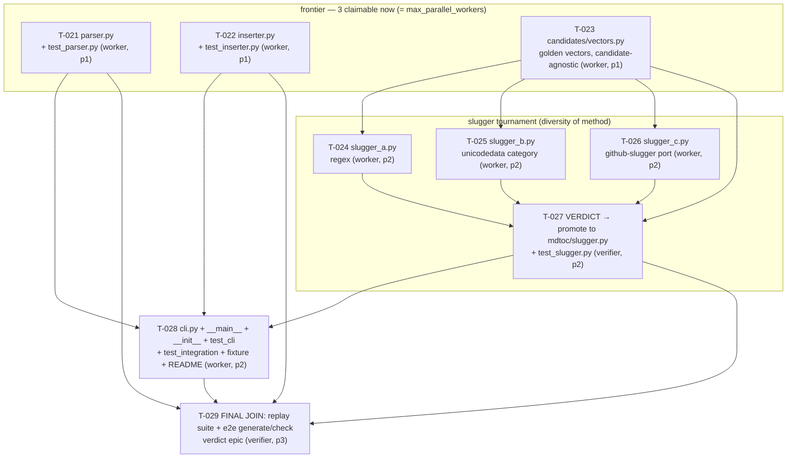

# Harness Build Plan (maintained by Thinkers; workers execute, verifiers gate)

> Owner: orchestration-planner / fable-5-coordinator.
> Rule: this file states WHY and IN WHAT ORDER; the blackboard states WHO and WHAT NOW.
> Lock this file (`lock.py acquire .harness/plan.md --holder <you>`) before rewriting it.

## Generation 0 — Substrate (DONE, this session)
Physical runtime substrate per claude.md §4 / gemini.md §4: guarded blackboard,
TTL write locks, JSONL observability (hook-fed), deterministic CLIs, agent bench,
Gemini prompt bridge, git baseline.

## Generation 0 → 1 — Frontier (parallel where independent)
- **T-002** Gemini contract test (bridge file: `prompts para Gemini/1.md`) — proves NLAH portability, feeds friction notes to the audit.
- **T-003** AST semantic indexer v0 — ZCode parity item #3.
- **T-004** Goal-mode runner v0 — ZCode parity item #1.
- **T-005** Remote messenger hook v0 — ZCode parity item #2 (human-gated activation).

## Generation 1 — Evolution loop (cascade: real dependency on evidence)
- **T-006** Audit trajectories from logs (claude.md §5A steps 1–2) — needs T-002/T-003/T-004 evidence to exist.
- **T-007** Gated mutation of claude.md/gemini.md (§5A steps 3–4) — needs T-006 verdicts; bumps `harness_generation`; git commit "generation 1".

## mdtoc (external real-use proof)

### Why
The harness has so far only built itself. **mdtoc** — a Markdown table-of-contents
CLI (`projects/mdtoc/`, Python 3.9+ stdlib only, matching repo culture) — is the first
*external* deliverable: it proves the full topology end-to-end (planner → parallel
workers → tournament → verifier join) on real product code the harness does not own.
Success = a green test suite + an idempotent end-to-end `generate`/`check` run, produced
by independent agents under disjoint file ownership, with the slugger chosen by a real
tournament rather than a single fragile guess.

### The DAG (T-021 … T-029, epic `mdtoc`, engine `claude`)

### Every edge is a real artifact-consumption (no false cascade)
- `T-023 → T-024/025/026` — each candidate imports `vectors.py` (shared interface + golden data) to self-check. Candidates have NO edges to each other.
- `T-023,T-024,T-025,T-026 → T-027` — the verdict literally runs `vectors.run_against` over all three candidate implementations to score them.
- `T-021,T-022,T-027 → T-028` — the CLI imports `parse_headings` (T-021), `render_toc`/`insert_toc` (T-022), and the *promoted* `slugify` (T-027). It depends on the **verdict, never on the candidates** (requirement 3).
- `T-021,T-022,T-027,T-028 → T-029` — the final join replays `test_parser` (T-021), `test_inserter` (T-022), `test_slugger`+`slugger.py` (T-027), and `test_cli`+`test_integration`+fixture+`mdtoc -m` (T-028). These four leaves transitively close over the whole DAG (T-028→T-027→{T-023,24,25,26}), so "everything must be done" is enforced **without** a false edge to the superseded candidate files.
- **No edges** between parser, inserter, and the slugger track: they are the independent frontier. The inserter takes `slugify` by **dependency injection** (a callable arg) so it never imports the slugger — that is what keeps it on the frontier with zero edge to the tournament.

### Disjoint file ownership (mechanical parallel safety)
No file appears in two tasks, so any concurrent subset is collision-free:
`parser.py`+`test_parser.py` (T-021) · `inserter.py`+`test_inserter.py` (T-022) ·
`candidates/vectors.py` (T-023) · `candidates/slugger_a.py` (T-024) ·
`candidates/slugger_b.py` (T-025) · `candidates/slugger_c.py` (T-026) ·
`mdtoc/slugger.py`+`test_slugger.py` (T-027) ·
`cli.py`+`__main__.py`+`__init__.py`+`test_cli.py`+`test_integration.py`+`fixtures/sample.md`+`README.md` (T-028) ·
T-029 owns nothing (replay-only). `__init__.py` is created solely by T-028; frontier
tests import `mdtoc` as a PEP-420 namespace package via a `sys.path` insert, so they run
before the package marker exists.

### Tournament rationale (the harness's first tournament)
GitHub anchor slugging is the one high-uncertainty node here (unicode word classes,
emoji, punctuation tables, per-document dedup) — exactly the case ORCHESTRATION.md §5
reserves for tournament/consensus. So instead of one fragile guess we run **three
method-diverse candidates against one candidate-agnostic golden test-vector file**:
- T-024 **regex-based** (`re` word-char class),
- T-025 **unicodedata category-based** (classify via `unicodedata.category`),
- T-026 **github-slugger spec-port** (port the upstream punctuation/emoji rules).

`vectors.py` (T-023) is authored **first** and imports no candidate; it fixes the
interface `slugify(text, seen) -> str` and the ground-truth cases (lowercasing,
punctuation strip, unicode retention, emoji removal, underscores, dedup `-1/-2`).
The verdict (T-027, verifier role) scores all three with `vectors.run_against`, picks by
pass-rate-then-clarity, and **promotes the winner to `mdtoc/slugger.py`** (copy + cite).
Producer ≠ approver holds: T-027 produces `slugger.py`; a different agent verdicts it,
and T-029 re-runs `test_slugger.py` against the promoted file.

### Worker-dispatch order (coordinator running max 3 parallel workers)
1. **Wave 1 (3 parallel):** T-021, T-022, T-023 — the whole frontier. Claim all three at
   once (this keeps the claimable set = 3; if T-023 finished while T-021/T-022 sat
   unclaimed, the candidates would open and the frontier could exceed 3).
2. **Verify wave 1** (verifier role marks T-021/T-022/T-023 done). Finishing T-023 opens
   the tournament.
3. **Wave 2 (3 parallel):** T-024, T-025, T-026 — the candidates (T-021/T-022 already done).
4. **Wave 3 (1, verifier):** T-027 — score + promote winner to `mdtoc/slugger.py`.
5. **Wave 4 (1, worker):** T-028 — CLI + package + integration test + fixture + README.
6. **Wave 5 (1, verifier):** T-029 — replay full suite + e2e; verdict the epic.

### Engine routing
All nine tasks are `--engine claude`: code architecture, spec judgment, and a
consensus verdict — no million-token digestion, heavy numeric math, or plotting, so
nothing is bridged to Gemini for this epic.

## Standing design rules
1. Default to parallel: only add a `depends_on` edge when a task literally consumes another task's artifact.
2. Every worker chain terminates in a verifier join (producer ≠ approver).
3. Task size ≤ `state.json limits.max_steps_per_task`; otherwise decompose further.
4. High-uncertainty nodes may use tournament mode: N parallel candidates, one verifier verdict (Co-Scientist pattern).

## TEMPLATE — Unknowns (4 quadrants) [copy this block into every new epic, per orchestration-planner.md steps 5-6 (U3 blindspot interview, U1 Unknowns section)]

> Populate this section for a NEW epic BEFORE its DAG is published. Every BLOCKING
> known-unknown must be closed (spike task id OR recorded human answer) before any worker
> task in the epic is claimable — an unresolved BLOCKING known-unknown means: do not publish
> the DAG yet.

### Epic: `<epic-name>` (example below is a worked illustration, not a live epic)

**Known knowns** (facts already verified in this repo/session):
- e.g. "`projects/mdtoc/` is pure-stdlib Python 3.9+, no third-party dependencies."

**Known unknowns** (questions we know we don't have answers to; classify each
BLOCKING or NON-BLOCKING):
- `[BLOCKING]` "Does the target test runner discover `tests/` via `unittest discover` or
  `pytest`, and does that require a `tests/__init__.py` package marker?"
  → **Resolution**: converted to spike task **T-0XX-spike** ("probe test-discovery
    mechanism, report which bootstrap files are required and who owns them"); every worker
    task that writes into `tests/` lists `depends_on: [T-0XX-spike]`. The DAG is NOT
    published until T-0XX-spike reports back and the bootstrap file gets an explicit owner
    (see the F1 decomposition rule in `orchestration-planner.md`).
- `[NON-BLOCKING]` "Will we eventually want a `--json` output mode?" → deferred; does not
  gate DAG publication, noted for a future epic.

**Unknown knowns** (things the human/operator knows but hasn't told the planner — the
candidate assumptions surfaced in the U3 blindspot interview):
- Assumption: "The operator wants re-runs to be idempotent (only replace content between
  the tool's own markers), not to blindly overwrite the whole file on every run."
  → **Human confirmation**: CONFIRMED 2026-0X-XX by operator — "yes, idempotent re-run,
    only replace content between the TOC markers." Recorded here per U3; the confirmed
    assumption becomes a known-known for every downstream task in this epic.

**Unknown unknowns** (acknowledged blind spot — no candidate list; this quadrant exists so
the planner does not pretend the first three quadrants are exhaustive):
- None identified yet for this epic. If one surfaces mid-execution (a worker hits friction
  the plan never anticipated), it does NOT get silently patched around — it is logged as a
  new known-unknown in the NEXT epic's Unknowns section (worked precedent: the mdtoc
  `tests/__init__.py` bootstrap-file friction, `.harness/logs/audit_gen3.md` P-013/F1).
