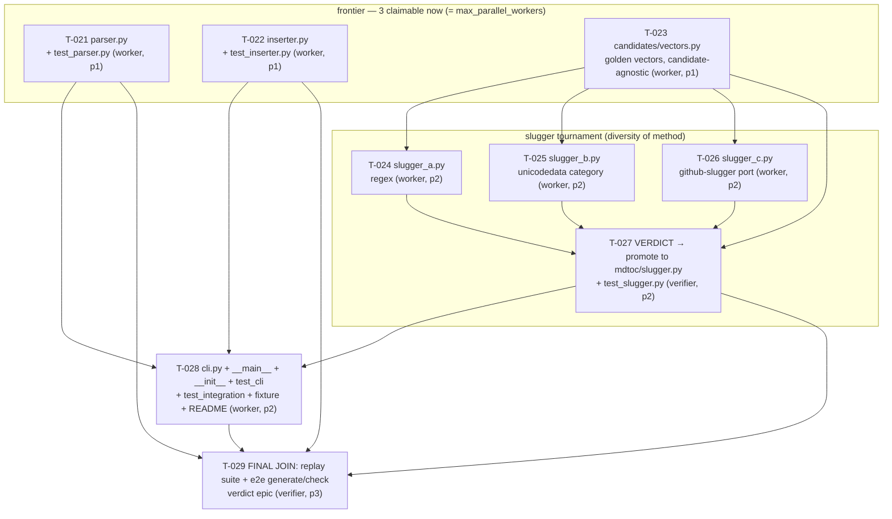
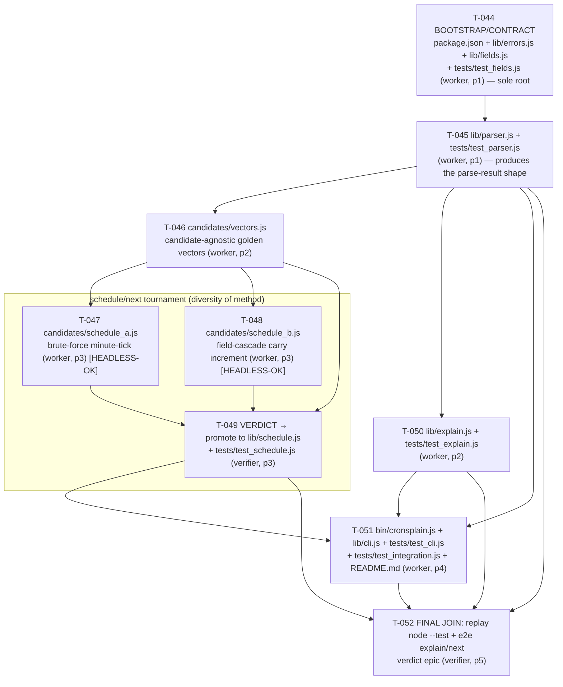
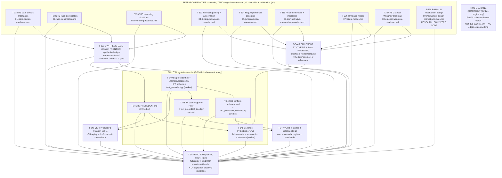
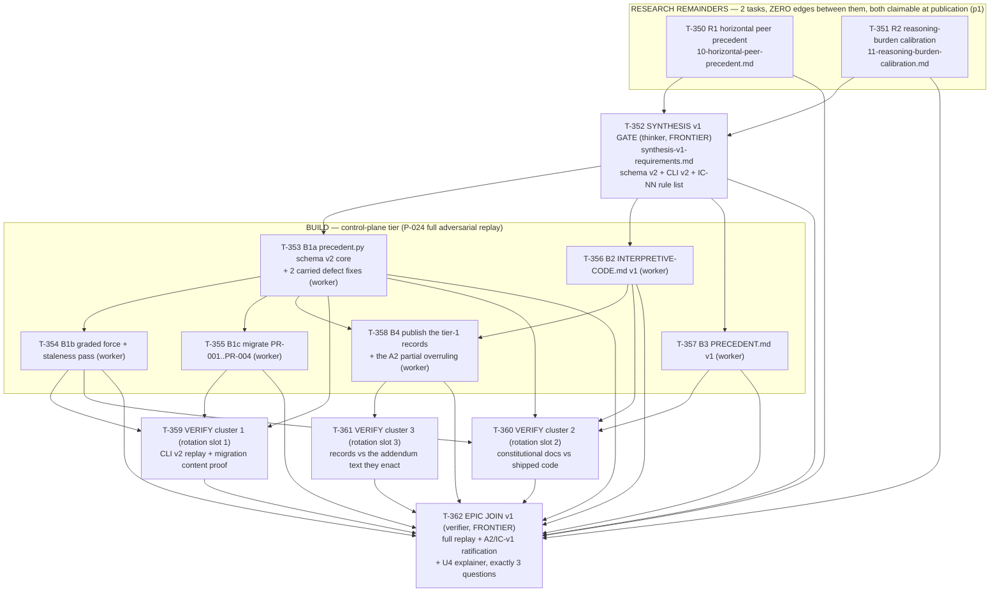
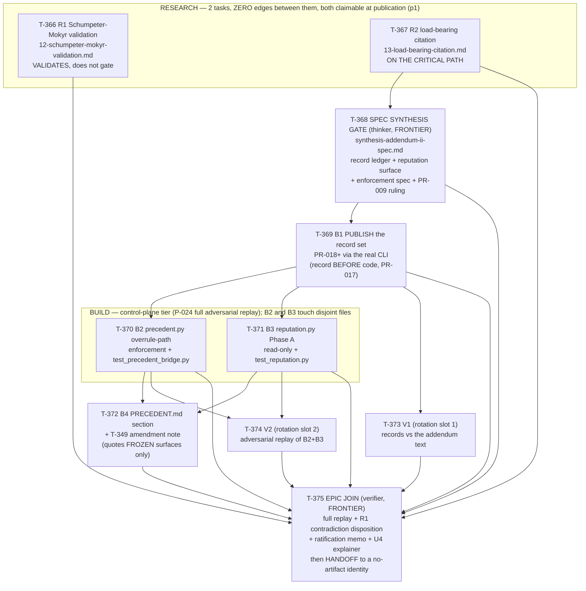

# Harness Build Plan (maintained by Thinkers; workers execute, verifiers gate)

> Owner: orchestration-planner / fable-5-coordinator.
> Rule: this file states WHY and IN WHAT ORDER; the blackboard states WHO and WHAT NOW.
> Lock this file (`lock.py acquire .harness/plan.md --holder <you>`) before rewriting it.

## Generation 0 — Substrate (DONE, this session)
Physical runtime substrate per claude.md §4 / gemini.md §4: guarded blackboard,
TTL write locks, JSONL observability (hook-fed), deterministic CLIs, agent bench,
Gemini prompt bridge, git baseline.

## Generation 0 → 1 — Frontier (parallel where independent)
- **T-002** Gemini contract test (bridge file: `prompts para Gemini/1.md`) — proves NLAH portability, feeds friction notes to the audit.
- **T-003** AST semantic indexer v0 — ZCode parity item #3.
- **T-004** Goal-mode runner v0 — ZCode parity item #1.
- **T-005** Remote messenger hook v0 — ZCode parity item #2 (human-gated activation).

## Generation 1 — Evolution loop (cascade: real dependency on evidence)
- **T-006** Audit trajectories from logs (claude.md §5A steps 1–2) — needs T-002/T-003/T-004 evidence to exist.
- **T-007** Gated mutation of claude.md/gemini.md (§5A steps 3–4) — needs T-006 verdicts; bumps `harness_generation`; git commit "generation 1".

## mdtoc (external real-use proof)

### Why
The harness has so far only built itself. **mdtoc** — a Markdown table-of-contents
CLI (`projects/mdtoc/`, Python 3.9+ stdlib only, matching repo culture) — is the first
*external* deliverable: it proves the full topology end-to-end (planner → parallel
workers → tournament → verifier join) on real product code the harness does not own.
Success = a green test suite + an idempotent end-to-end `generate`/`check` run, produced
by independent agents under disjoint file ownership, with the slugger chosen by a real
tournament rather than a single fragile guess.

### The DAG (T-021 … T-029, epic `mdtoc`, engine `claude`)

```mermaid
graph TD
  subgraph frontier["frontier — 3 claimable now (= max_parallel_workers)"]
    T021["T-021 parser.py<br/>+ test_parser.py (worker, p1)"]
    T022["T-022 inserter.py<br/>+ test_inserter.py (worker, p1)"]
    T023["T-023 candidates/vectors.py<br/>golden vectors, candidate-agnostic (worker, p1)"]
  end
  subgraph tourney["slugger tournament (diversity of method)"]
    T024["T-024 slugger_a.py<br/>regex (worker, p2)"]
    T025["T-025 slugger_b.py<br/>unicodedata category (worker, p2)"]
    T026["T-026 slugger_c.py<br/>github-slugger port (worker, p2)"]
    T027["T-027 VERDICT → promote to mdtoc/slugger.py<br/>+ test_slugger.py (verifier, p2)"]
  end
  T028["T-028 cli.py + __main__ + __init__ + test_cli<br/>+ test_integration + fixture + README (worker, p2)"]
  T029["T-029 FINAL JOIN: replay suite + e2e generate/check<br/>verdict epic (verifier, p3)"]

  T023 --> T024
  T023 --> T025
  T023 --> T026
  T023 --> T027
  T024 --> T027
  T025 --> T027
  T026 --> T027
  T021 --> T028
  T022 --> T028
  T027 --> T028
  T021 --> T029
  T022 --> T029
  T027 --> T029
  T028 --> T029
```

### Every edge is a real artifact-consumption (no false cascade)
- `T-023 → T-024/025/026` — each candidate imports `vectors.py` (shared interface + golden data) to self-check. Candidates have NO edges to each other.
- `T-023,T-024,T-025,T-026 → T-027` — the verdict literally runs `vectors.run_against` over all three candidate implementations to score them.
- `T-021,T-022,T-027 → T-028` — the CLI imports `parse_headings` (T-021), `render_toc`/`insert_toc` (T-022), and the *promoted* `slugify` (T-027). It depends on the **verdict, never on the candidates** (requirement 3).
- `T-021,T-022,T-027,T-028 → T-029` — the final join replays `test_parser` (T-021), `test_inserter` (T-022), `test_slugger`+`slugger.py` (T-027), and `test_cli`+`test_integration`+fixture+`mdtoc -m` (T-028). These four leaves transitively close over the whole DAG (T-028→T-027→{T-023,24,25,26}), so "everything must be done" is enforced **without** a false edge to the superseded candidate files.
- **No edges** between parser, inserter, and the slugger track: they are the independent frontier. The inserter takes `slugify` by **dependency injection** (a callable arg) so it never imports the slugger — that is what keeps it on the frontier with zero edge to the tournament.

### Disjoint file ownership (mechanical parallel safety)
No file appears in two tasks, so any concurrent subset is collision-free:
`parser.py`+`test_parser.py` (T-021) · `inserter.py`+`test_inserter.py` (T-022) ·
`candidates/vectors.py` (T-023) · `candidates/slugger_a.py` (T-024) ·
`candidates/slugger_b.py` (T-025) · `candidates/slugger_c.py` (T-026) ·
`mdtoc/slugger.py`+`test_slugger.py` (T-027) ·
`cli.py`+`__main__.py`+`__init__.py`+`test_cli.py`+`test_integration.py`+`fixtures/sample.md`+`README.md` (T-028) ·
T-029 owns nothing (replay-only). `__init__.py` is created solely by T-028; frontier
tests import `mdtoc` as a PEP-420 namespace package via a `sys.path` insert, so they run
before the package marker exists.

### Tournament rationale (the harness's first tournament)
GitHub anchor slugging is the one high-uncertainty node here (unicode word classes,
emoji, punctuation tables, per-document dedup) — exactly the case ORCHESTRATION.md §5
reserves for tournament/consensus. So instead of one fragile guess we run **three
method-diverse candidates against one candidate-agnostic golden test-vector file**:
- T-024 **regex-based** (`re` word-char class),
- T-025 **unicodedata category-based** (classify via `unicodedata.category`),
- T-026 **github-slugger spec-port** (port the upstream punctuation/emoji rules).

`vectors.py` (T-023) is authored **first** and imports no candidate; it fixes the
interface `slugify(text, seen) -> str` and the ground-truth cases (lowercasing,
punctuation strip, unicode retention, emoji removal, underscores, dedup `-1/-2`).
The verdict (T-027, verifier role) scores all three with `vectors.run_against`, picks by
pass-rate-then-clarity, and **promotes the winner to `mdtoc/slugger.py`** (copy + cite).
Producer ≠ approver holds: T-027 produces `slugger.py`; a different agent verdicts it,
and T-029 re-runs `test_slugger.py` against the promoted file.

### Worker-dispatch order (coordinator running max 3 parallel workers)
1. **Wave 1 (3 parallel):** T-021, T-022, T-023 — the whole frontier. Claim all three at
   once (this keeps the claimable set = 3; if T-023 finished while T-021/T-022 sat
   unclaimed, the candidates would open and the frontier could exceed 3).
2. **Verify wave 1** (verifier role marks T-021/T-022/T-023 done). Finishing T-023 opens
   the tournament.
3. **Wave 2 (3 parallel):** T-024, T-025, T-026 — the candidates (T-021/T-022 already done).
4. **Wave 3 (1, verifier):** T-027 — score + promote winner to `mdtoc/slugger.py`.
5. **Wave 4 (1, worker):** T-028 — CLI + package + integration test + fixture + README.
6. **Wave 5 (1, verifier):** T-029 — replay full suite + e2e; verdict the epic.

### Engine routing
All nine tasks are `--engine claude`: code architecture, spec judgment, and a
consensus verdict — no million-token digestion, heavy numeric math, or plotting, so
nothing is bridged to Gemini for this epic.

## cronsplain (external real-use proof #2 — NON-Python, Node.js)  [PUBLISHED 2026-07-05 — T-044..T-052 LIVE on the board]

> STATUS: **PHASE 2 PUBLISHED 2026-07-05.** All 4 BLOCKING known-unknowns (Q1–Q4) were
> answered by fable-5-coordinator (delegated operator authority; operator veto until ship)
> and recorded in the `## Unknowns` Confirmation lines — every planner default ACCEPTED as
> written. Tasks T-044..T-052 were then published via `blackboard.py add-task`; acceptance
> criteria filled in each `.harness/tasks/T-04x/05x.json`. T-043 is handed to a verifier as
> the phase-2 gate. (Phase 1 = interview-only; the DAG below was a DRAFT until Q1–Q4 closed.)

### Why
The harness has proven itself on itself and on one Python deliverable (mdtoc). **cronsplain**
— a Node.js CLI (`projects/cronsplain/`, node v24, `node:test` built-in runner, ZERO npm
dependencies) — is the second external deliverable and closes readiness criteria 3 (a
**non-Python** repo, source untouched, full epic end-to-end) and 4 (U1–U4 exercised for
real). Goal: parse standard 5-field cron expressions and expose two commands —
`explain <expr>` → human-readable English, and `next <expr> [--from ISO] [--count N]` →
next N occurrences in UTC — with the classic day-of-month OR day-of-week quirk correct and
clean (stack-trace-free) errors on invalid input.

### Key NON-Python fact that reshapes bootstrap ownership (F1)
`node --test` discovers tests by filename glob (`**/*.test.js`, `**/test/**/*.js`, etc.) and
needs **NO package-marker file** — there is no `tests/__init__.py`-class artifact here (the
exact friction the mdtoc epic raced, audit_gen3 P-013/F1). The analogous shared-infra file
in Node is **`package.json`** (it fixes the module system CommonJS-vs-ESM, the `test`
script, `bin`, and `engines`). Every `.js` file must agree on `require` vs `import` BEFORE
parallel workers write them, so the module-system decision is a true shared contract
(BLOCKING Q4, CONFIRMED CommonJS) and `package.json` is owned by exactly ONE task (T-044, root).

### The DAG (T-044 … T-052, epic `cronsplain`, engine `claude`) — PUBLISHED

```mermaid
graph TD
  T044["T-044 BOOTSTRAP/CONTRACT<br/>package.json + lib/errors.js + lib/fields.js<br/>+ tests/test_fields.js (worker, p1) — sole root"]
  T045["T-045 lib/parser.js + tests/test_parser.js<br/>(worker, p1) — produces the parse-result shape"]
  T046["T-046 candidates/vectors.js<br/>candidate-agnostic golden vectors (worker, p2)"]
  T050["T-050 lib/explain.js + tests/test_explain.js<br/>(worker, p2)"]
  subgraph tourney["schedule/next tournament (diversity of method)"]
    T047["T-047 candidates/schedule_a.js<br/>brute-force minute-tick (worker, p3) [HEADLESS-OK]"]
    T048["T-048 candidates/schedule_b.js<br/>field-cascade carry increment (worker, p3) [HEADLESS-OK]"]
    T049["T-049 VERDICT → promote to lib/schedule.js<br/>+ tests/test_schedule.js (verifier, p3)"]
  end
  T051["T-051 bin/cronsplain.js + lib/cli.js + tests/test_cli.js<br/>+ tests/test_integration.js + README.md (worker, p4)"]
  T052["T-052 FINAL JOIN: replay node --test + e2e explain/next<br/>verdict epic (verifier, p5)"]

  T044 --> T045
  T045 --> T046
  T045 --> T050
  T046 --> T047
  T046 --> T048
  T046 --> T049
  T047 --> T049
  T048 --> T049
  T045 --> T051
  T050 --> T051
  T049 --> T051
  T045 --> T052
  T049 --> T052
  T050 --> T052
  T051 --> T052
```

### Every edge is a real artifact-consumption (no false cascade)
- `T-044 → T-045` — parser `require`s `lib/errors.js` (throws `CronParseError`) and
  `lib/fields.js` (field order, bounds, JAN-DEC/SUN-SAT name maps). Real consumption.
- `T-045 → T-046` — `vectors.js` calls the real `parser` to build the `parsed` inputs it
  feeds candidates (it imports the PARSER, never a candidate). Real consumption.
- `T-045 → T-050` — `explain.js` renders English from the parser's output; its tests parse
  real expressions then assert the sentence. Real consumption.
- `T-046 → T-047` / `T-046 → T-048` — each schedule candidate `require`s `vectors.js` to
  self-check against the fixed interface + golden cases. Candidates have NO edge to each
  other (T-047 ⟂ T-048) — this pair is the deliberate concurrency slot for the swarm smoke.
- `T-046,T-047,T-048 → T-049` — the verdict runs the `vectors.js` harness over both
  candidate implementations to score them, then promotes the winner to `lib/schedule.js`.
- `T-045 → T-051` — the CLI `require`s `parser` (to parse then dispatch) and catches
  `CronParseError` for clean messages. Real consumption.
- `T-050 → T-051` — the CLI `explain` command calls `explain.js`. Real consumption.
- `T-049 → T-051` — the CLI `next` command calls the **promoted `lib/schedule.js`**; it
  depends on the VERDICT, never on a candidate (mirrors the mdtoc requirement). Real.
- `T-045,T-049,T-050,T-051 → T-052` — the final join replays `test_parser`,
  `test_schedule`+`schedule.js`, `test_explain`, and `test_cli`+`test_integration`+e2e CLI.
  These four leaves transitively close over the whole DAG (T-051→T-049→{T-046,47,48}→T-045
  →T-044), so "everything done" is enforced without a false edge to the superseded candidates.
- **No edge** T-050 → the schedule track: `explain` depends only on the parser, so it runs
  in parallel with the tournament (the independent frontier of wave 3).

### Disjoint file ownership (mechanical parallel safety)
No file appears in two tasks, so any concurrent subset is collision-free:
- T-044: `package.json` · `lib/errors.js` · `lib/fields.js` · `tests/test_fields.js`
- T-045: `lib/parser.js` · `tests/test_parser.js`
- T-046: `candidates/vectors.js`
- T-047: `candidates/schedule_a.js`
- T-048: `candidates/schedule_b.js`
- T-049: `lib/schedule.js` · `tests/test_schedule.js` (promoted winner + its test)
- T-050: `lib/explain.js` · `tests/test_explain.js`
- T-051: `bin/cronsplain.js` · `lib/cli.js` · `tests/test_cli.js` · `tests/test_integration.js` · `README.md`
- T-052: owns nothing (replay-only join).

**Bootstrap/infra ownership (F1):** the only shared-infra files — `package.json`,
`lib/errors.js`, `lib/fields.js` — are owned SOLELY by T-044 (the root), and every other
task transitively depends on T-044, so no sibling can race them. There is NO
`tests/__init__.py`-class package marker in Node (see the NON-Python fact above), so the
mdtoc race cannot recur here.

### Headless-claimable task (readiness criterion 2 — swarm smoke)
**T-047 and T-048 (the two schedule candidates) are shaped for a HEADLESS second session**
(`claude -p`, cross-session identity, no in-session registration). Each is fully specified
by (a) its own task description + acceptance criteria and (b) `candidates/vectors.js`
(T-046), which fixes the interface `nextOccurrences(parsed, fromDate, count) -> Date[]` and
the golden ground-truth as a FILE — so a headless agent reads vectors.js, implements its
`schedule_?.js` to pass those vectors, and hands off with ZERO conversational context.
Their JSONs (`.harness/tasks/T-047.json`, `T-048.json`) carry the FULL interface contract,
the parsed-shape note, the self-check command, and the cross-session identity convention
(export `CLAUDE_HARNESS_AGENT_ID` or pass `--agent`/`--holder`; do NOT `session.py register`
— cross-session holders must stay mechanically blocked for others; that invariant is under
test). Because T-047 ⟂ T-048 share no file and both depend only on T-046, two concurrent
sessions (one headless) can claim them at the same time — this pair IS the swarm-smoke slot.

### Tournament rationale (the high-uncertainty node)
The `next`-occurrence computation is the one genuinely fragile node: the DOM/DOW OR quirk,
minute→hour→day→month→year rollover, leap-Feb-29, step edges, and `--from` exclusivity all
compound. Per ORCHESTRATION.md §5 that is exactly the tournament/consensus case. Two
method-diverse candidates against one candidate-agnostic golden-vector file:
- T-047 **brute-force minute-tick**: from `--from`, advance one minute at a time and test
  each minute against the field matchers (simple, obviously-correct, bounded iteration cap).
- T-048 **field-cascade carry increment**: compute the next matching minute, carry into
  hour/day/month with rollover (faster, trickier — the diversity payoff).
`vectors.js` (T-046) is authored first, imports the parser (not a candidate), and the
verdict (T-049, verifier role) scores both with the vectors harness and promotes the winner
to `lib/schedule.js`. Producer ≠ approver holds: T-049 produces `schedule.js`; a DIFFERENT
agent verdicts T-049, and T-052 re-runs `test_schedule.js` against the promoted file.

### Verifier rotation (F6)
T-049 (schedule verdict) and T-052 (epic final join) MUST be verdicted by reviewer
identities distinct from every producer in the epic AND from each other — no sole approver
across the epic (ORCHESTRATION.md §4, the mdtoc single-`harness-verifier` counter-example).

### Worker-dispatch order (coordinator running max 3 parallel workers) — PHASE 2 PUBLISHED
1. **Wave 1 (1):** T-044 bootstrap/contract (sole root — module system + shared infra).
2. **Wave 2 (1):** T-045 parser (only consumer of just T-044; it is the parse-result source).
3. **Wave 3 (2 parallel):** T-046 vectors + T-050 explain (both depend only on T-045).
4. **Wave 4 (≤3 parallel):** T-047 + T-048 candidates (depend on T-046); T-050 explain may
   still be finishing in parallel — at most 3 concurrent, within `max_parallel_workers`.
   This is the swarm-smoke wave (candidates claimable by concurrent/headless sessions).
5. **Wave 5 (1, verifier):** T-049 verdict → promote winner to `lib/schedule.js`.
6. **Wave 6 (1, worker):** T-051 CLI + integration + README.
7. **Wave 7 (1, verifier):** T-052 final join — replay `node --test` + e2e; verdict the epic.

### Engine routing
All nine tasks are `--engine claude`: parser grammar judgment, English rendering, a
consensus verdict, and CLI architecture. The `next` math is light integer/date arithmetic
(not million-token digestion, not heavy numeric/plotting), so **nothing is bridged to
Gemini** for this epic.

## Unknowns — Epic: `cronsplain` (populated per orchestration-planner.md steps 5-6, U1+U3)

> Populated BEFORE the DAG was published. All 4 BLOCKING known-unknowns were posed as numbered
> questions to the coordinator/human (route (b)) and ANSWERED 2026-07-05 (see Confirmation
> lines below) — every default ACCEPTED. The DAG (T-044..T-052) is now PUBLISHED. (Route (a)
> spike tasks were rejected: these are spec/semantic decisions the operator holds, not facts a
> probe task can discover.)

**Known knowns** (verified this session):
- Runtime present: `node v24.15.0`, `npm 11.12.1`; `node:test` is built in (no dependency).
- `node --test` discovers tests by filename glob and needs NO package-marker file — there is
  NO `tests/__init__.py`-class artifact in this epic (contrast mdtoc; audit_gen3 P-013/F1).
- Spec-fixed scope: 5 fields (minute, hour, day-of-month, month, day-of-week); syntaxes
  values, ranges `a-b`, steps `*/n` and `a-b/n`, lists `a,b,c`, names JAN-DEC/SUN-SAT,
  wildcard `*`; commands `explain` and `next`; output in UTC; zero npm dependencies.
- `projects/cronsplain/` does not yet exist; the harness must not touch any other project's source.

**Known unknowns** (each classified BLOCKING / NON-BLOCKING; all 4 BLOCKING now CLOSED):
- **Q1 [BLOCKING → CLOSED] Exact accepted grammar boundary.** Are Vixie extensions IN or OUT —
  `@daily`/`@hourly`/`@reboot` macros, `L`, `W`, `#`, `?`, and the bare start-step form
  `a/n` (e.g. `3/5`)? Spec enumerates only `*/n` and `a-b/n`, so the default treats all of
  these as INVALID (clean error). Gates the parser accept/reject logic (T-045) and every
  error-path test (T-045, T-051, vectors T-046). → CONFIRMED 2026-07-05 (default accepted).
- **Q2 [BLOCKING → CLOSED] Day-of-month OR day-of-week coupling.** Confirm the exact rule: when
  BOTH dom and dow are restricted (neither `*`) a day matches if EITHER matches (Vixie
  OR/union); when exactly one is `*` only the other constrains; when both `*` every day
  matches. Gates the golden vectors (T-046) and the schedule computation (T-047/T-048/T-049) —
  a wrong rule invalidates the whole tournament ground truth. → CONFIRMED 2026-07-05.
- **Q3 [BLOCKING → CLOSED] `next` inclusivity of the `--from` instant.** Is the first returned
  occurrence strictly AFTER `--from` (exclusive) or does an exactly-matching `--from` minute
  count (inclusive)? Default: EXCLUSIVE (strictly-after, seconds/millis zeroed to minute).
  Gates every golden Date[] in vectors (T-046) — an off-by-one here corrupts the tournament.
  → CONFIRMED 2026-07-05 (exclusive).
- **Q4 [BLOCKING → CLOSED] Module system (F1 shared contract).** CommonJS
  (`require`/`module.exports`, no `"type"`) vs ESM (`"type":"module"`, `import`)? Every `.js`
  file and test must agree BEFORE parallel workers write them; `package.json` (owner T-044)
  fixes it. Default: CommonJS. Gates ALL file authorship across the epic.
  → CONFIRMED 2026-07-05 (CommonJS).
- **Q5 [NON-BLOCKING] `--from` naive-ISO interpretation + `--count` default.** If `--from`
  has no offset/`Z`, interpret as UTC (default); default `--count` when omitted (default 5);
  default `--from` when omitted = now(). Each is owned/tested inside T-051; does not gate
  other tasks. Deferred to the producer with the stated defaults.
- **Q6 [NON-BLOCKING] Output-format wording/stability.** Exact `explain` sentence phrasing
  and `next` timestamp format (default ISO-8601 UTC with trailing `Z`, one per line). Each
  producer owns its own output + tests; the final join replays them. No cross-task contract.
- **Q7 [NON-BLOCKING] `engines` floor in package.json.** Default `"node": ">=18"` (node:test
  present since 18), developed/run on v24. package.json field only (T-044); gates nothing.

**Unknown knowns** (candidate assumptions from the U3 blindspot interview — things the
operator likely knows but the planner has not been told; each carries the DEFAULT baked into
the DAG). ANSWERED — all confirmations recorded below:
1. **Grammar set.** Standard 5-field POSIX + `,` lists + `-` ranges + `*/n` and `a-b/n` steps
   + names JAN-DEC(1-12) & SUN-SAT with SUN=0 and 7≡0 (Sunday), names case-insensitive + `*`.
   Vixie `@macros`, `L`, `W`, `#`, `?`, and bare `a/n` step are OUT → invalid → clean error.
   → **DEFAULT if unconfirmed:** exactly this set; extensions rejected. (Answers Q1.)
   → **Confirmation:** CONFIRMED 2026-07-05 by fable-5-coordinator under delegated operator authority (operator directive 2026-07-05: complete production-readiness autonomously; technical defaults with conventional answers do not require operator round-trips). DEFAULT ACCEPTED as written. Operator retains veto until the epic ships - confirmations surfaced in the coordinator report.
2. **DOM/DOW coupling.** OR/union when both dom and dow are restricted; only the non-`*`
   field constrains when one is `*`; all days when both `*`.
   → **DEFAULT if unconfirmed:** OR-when-both-restricted (the classic Vixie quirk). (Answers Q2.)
   → **Confirmation:** CONFIRMED 2026-07-05 by fable-5-coordinator under delegated operator authority (operator directive 2026-07-05: complete production-readiness autonomously; technical defaults with conventional answers do not require operator round-trips). DEFAULT ACCEPTED as written. Operator retains veto until the epic ships - confirmations surfaced in the coordinator report.
3. **`next` boundary + shape.** Occurrences are strictly AFTER `--from` (exclusive), minute-
   aligned (seconds/millis = 0), ascending UTC; `--count` default 5; `--from` default now().
   → **DEFAULT if unconfirmed:** exclusive; count 5; from now. (Answers Q3 + Q5.)
   → **Confirmation:** CONFIRMED 2026-07-05 by fable-5-coordinator under delegated operator authority (operator directive 2026-07-05: complete production-readiness autonomously; technical defaults with conventional answers do not require operator round-trips). DEFAULT ACCEPTED as written. Operator retains veto until the epic ships - confirmations surfaced in the coordinator report.
4. **Timezone.** All matching/output in UTC; naive `--from` (no offset) read as UTC, offset/`Z`
   respected then converted to the UTC instant; output ISO-8601 with trailing `Z`; DST N/A.
   → **DEFAULT if unconfirmed:** naive ISO = UTC, output ISO-8601 `Z`. (Answers Q5/Q6 tz part.)
   → **Confirmation:** CONFIRMED 2026-07-05 by fable-5-coordinator under delegated operator authority (operator directive 2026-07-05: complete production-readiness autonomously; technical defaults with conventional answers do not require operator round-trips). DEFAULT ACCEPTED as written. Operator retains veto until the epic ships - confirmations surfaced in the coordinator report.
5. **Packaging & module system.** Ship a real `package.json` (name `cronsplain`,
   `"bin":{"cronsplain":"bin/cronsplain.js"}`, `"scripts":{"test":"node --test"}`,
   `"engines":{"node":">=18"}`, zero deps), **CommonJS** (`require`/`module.exports`, NO
   `"type":"module"`); runs as `node bin/cronsplain.js <cmd>`.
   → **DEFAULT if unconfirmed:** CommonJS + package.json as above. (Answers Q4 + Q7.)
   → **Confirmation:** CONFIRMED 2026-07-05 by fable-5-coordinator under delegated operator authority (operator directive 2026-07-05: complete production-readiness autonomously; technical defaults with conventional answers do not require operator round-trips). DEFAULT ACCEPTED as written. Operator retains veto until the epic ships - confirmations surfaced in the coordinator report.

**Unknown unknowns** (acknowledged blind spot — no candidate list):
- None identified yet. If a worker hits friction the plan never anticipated (e.g. a
  `node:test` runner quirk, or a cron edge the golden vectors missed), it is NOT silently
  patched around — it is logged as a new known-unknown in the NEXT epic's Unknowns section
  and as an `OPEN-QUESTION:` note for the gen-4 audit (worked precedent: mdtoc
  `tests/__init__.py`, `.harness/logs/audit_gen3.md` P-013/F1).

## precedent-layer (jurisprudence for agent sessions)  [PUBLISHED 2026-08-10 — T-330..T-349 LIVE on the board]

> STATUS: **PUBLISHED 2026-08-10** by `orchestration-planner`. All BLOCKING known-unknowns were
> closed before publication — five by the coordinator decision memo
> (`.harness/coordinator-decisions-precedent-layer.md`, D1–D8, route (b): recorded answer), three
> by repo evidence resolved in this plan (route (b) as well: planner decision grounded in a cited
> file, recorded in `## Unknowns — Epic: precedent-layer` below). No spike task was needed: none
> of the open questions was a fact a probe could discover — they were scoping and authority
> decisions the coordinator/operator holds, or invariants already written down in the repo.

### Why

The harness has records but no law. Handoff notes, `DECISION:` prefixes and the ~30-deep
P-number ledger are **memos**: descriptive, disposable, no normative force. Roadmap Part II
(`docs/civilizational-roadmap-brief.md:28-58`) asks for the leap from bureaucracy to legal
order — records that **bind** successors unless explicitly overruled with reasoning. Four
deliverables: a precedent-aware record schema (ratio/dicta, scope conditions, authority level,
citation IDs), a queryable citation index, an overruling protocol, and a conflict-detection
pass. The brief gates all of it behind a seven-item legal-research agenda with a hard rule:
*schema design may begin once items 1–3 are synthesized; items 4–7 refine it* (line 57).

Two facts from the corpus survey (`.harness/corpus-grounding-precedent-layer.md`) shape the
acceptance criteria more than anything in the brief:

1. **Author-declared ratio is roughly trustworthy; author-declared blast radius is not.**
   Measured: benefit attribution precision 33.7% / recall 51.4% (~5x random) versus regression
   precision 11.8% / recall 11.1% against 5.6%/5.4% random baselines (~2x)
   (`papers/agentic_harness_engineering.pdf:9`, §4.4.2 "Regression blindness"). Therefore the
   schema lets the author declare the **ratio** and bind on publication, but **scope conditions
   do not bind until a verifier confirms them**, and the unconfirmed state must be mechanically
   distinguishable — not a prose convention. This is criterion-level, not advisory: T-339 fixes
   it, T-340 implements it, T-346 attacks it (invariant (c)).
2. **Non-additive interaction risk: one more layer that re-does existing verification can
   regress the system.** Measured: "+ system_prompt only" scored −2.3pp aggregate, the only
   regression among four single-component swaps; "components interact non-additively… stacking
   them spends turns on redundant re-checks" (`papers/agentic_harness_engineering.pdf:8` Table 3
   RQ3a, p.9). Therefore every task in this epic carries an **extend-do-not-duplicate**
   criterion naming the existing record it extends (note taxonomy `ORCHESTRATION.md:69-77`, the
   `reopen` verb `blackboard.py:470-517`, the P-number ledger in `state.json`, `events.jsonl`,
   `recontext.py`), and the check is concrete: **no new log file**, records point at the issuing
   task's existing verdict instead of re-recording verification, `PRECEDENT.md` cites
   `ORCHESTRATION.md` rules instead of restating them. T-348 confirms it end to end.

### The DAG (T-330 … T-349, epic `precedent-layer`, engine `claude` except T-349 `any`)

```mermaid
graph TD
  subgraph research["RESEARCH FRONTIER — 9 tasks, ZERO edges between them, all claimable at publication (p1)"]
    T330["T-330 R1 stare decisis mechanics<br/>01-stare-decisis-mechanics.md"]
    T331["T-331 R2 ratio identification<br/>02-ratio-identification.md"]
    T332["T-332 R3 overruling doctrines<br/>03-overruling-doctrines.md"]
    T333["T-333 R4 distinguishing / anti-evasion<br/>04-distinguishing-anti-evasion.md"]
    T334["T-334 R5 jurisprudencia constante<br/>05-jurisprudencia-constante.md"]
    T335["T-335 R6 administrative + mercantile<br/>06-administrative-mercantile-precedent.md"]
    T336["T-336 R7 failure modes<br/>07-failure-modes.md"]
    T337["T-337 R8 Graeber-Wengrow steelman<br/>08-graeber-wengrow-steelman.md"]
    T338["T-338 R9 Part III mechanism design<br/>09-mechanism-design-market-primitives.md<br/>RESEARCH ONLY, ZERO CODE"]
  end
  T339["T-339 SYNTHESIS GATE (thinker, FRONTIER)<br/>synthesis-design-requirements.md<br/>= the brief's items-1-3 gate"]
  T344["T-344 REFINEMENT SYNTHESIS (thinker, FRONTIER)<br/>synthesis-refinements.md<br/>= the brief's items-4-7 refinement"]
  subgraph build["BUILD — control-plane tier (P-024 full adversarial replay)"]
    T340["T-340 B1 precedent.py + .harness/precedents/<br/>+ PR schema + test_precedent.py (worker)"]
    T341["T-341 B2 PRECEDENT.md v0 (worker)"]
    T342["T-342 B3 conflicts subcommand<br/>+ test_precedent_conflicts.py (worker)"]
    T343["T-343 B4 seed migration PR x4<br/>+ test_precedent_seed.py (worker)"]
    T345["T-345 B5 refine PRECEDENT.md<br/>failure-mode + anti-evasion + steelman (worker)"]
  end
  T346["T-346 VERIFY cluster 1 (rotation slot 1)<br/>CLI replay + doc/code drift cross-check"]
  T347["T-347 VERIFY cluster 2 (rotation slot 2)<br/>own adversarial registry + seed audit"]
  T348["T-348 EPIC JOIN (verifier, FRONTIER)<br/>full replay + D1/D2/D4 operator ratification<br/>+ U4 explainer, exactly 3 questions"]
  T349["T-349 STANDING QUARTERLY (thinker, engine any)<br/>Part VI richer-vs-thinner watch<br/>next due 2026-11-10 — NO edges, gates nothing"]

  T330 --> T339
  T331 --> T339
  T332 --> T339
  T339 --> T340
  T339 --> T341
  T340 --> T342
  T340 --> T343
  T333 --> T344
  T334 --> T344
  T335 --> T344
  T336 --> T344
  T337 --> T344
  T344 --> T345
  T341 --> T345
  T342 --> T345
  T340 --> T346
  T341 --> T346
  T342 --> T347
  T343 --> T347
  T330 --> T348
  T331 --> T348
  T332 --> T348
  T333 --> T348
  T334 --> T348
  T335 --> T348
  T336 --> T348
  T337 --> T348
  T338 --> T348
  T339 --> T348
  T340 --> T348
  T341 --> T348
  T342 --> T348
  T343 --> T348
  T344 --> T348
  T345 --> T348
  T346 --> T348
  T347 --> T348
```

### Task table

| ID | Role | Engine | Tier (P-030) | Prio | Depends on | Owns (sole writer) |
|---|---|---|---|---|---|---|
| T-330 | worker | claude | sonnet | 1 | — | `docs/precedent-research/01-stare-decisis-mechanics.md` |
| T-331 | worker | claude | sonnet | 1 | — | `…/02-ratio-identification.md` |
| T-332 | worker | claude | sonnet | 1 | — | `…/03-overruling-doctrines.md` |
| T-333 | worker | claude | sonnet | 1 | — | `…/04-distinguishing-anti-evasion.md` |
| T-334 | worker | claude | sonnet | 1 | — | `…/05-jurisprudencia-constante.md` |
| T-335 | worker | claude | sonnet | 1 | — | `…/06-administrative-mercantile-precedent.md` |
| T-336 | worker | claude | sonnet | 1 | — | `…/07-failure-modes.md` |
| T-337 | worker | claude | sonnet | 1 | — | `…/08-graeber-wengrow-steelman.md` |
| T-338 | worker | claude | sonnet | 1 | — | `…/09-mechanism-design-market-primitives.md` |
| T-339 | thinker | claude | **frontier** | 2 | T-330,331,332 | `…/synthesis-design-requirements.md` |
| T-340 | worker | claude | sonnet | 2 | T-339 | `.harness/bin/precedent.py`, `.harness/precedents/`, `.harness/tests/test_precedent.py` |
| T-341 | worker | claude | sonnet | 2 | T-339 | `PRECEDENT.md` (creates) |
| T-342 | worker | claude | sonnet | 3 | T-340 | `conflicts` subcommand in `precedent.py`, `.harness/tests/test_precedent_conflicts.py` |
| T-343 | worker | claude | sonnet | 3 | T-340 | the 4 live `.harness/precedents/PR-*.json`, `.harness/tests/test_precedent_seed.py` |
| T-344 | thinker | claude | **frontier** | 2 | T-333,334,335,336,337 | `…/synthesis-refinements.md` |
| T-345 | worker | claude | sonnet | 4 | T-344,T-341,T-342 | `PRECEDENT.md` (refines) |
| T-346 | verifier | claude | sonnet | 4 | T-340,T-341 | nothing (replay-only) |
| T-347 | verifier | claude | sonnet | 4 | T-342,T-343 | nothing (replay-only) |
| T-348 | verifier | claude | **frontier** | 5 | all 18 above | `docs/precedent-layer-explainer.html`, `docs/precedent-research/README.md` |
| T-349 | thinker | any | sonnet | 6 | — | `docs/monitoring/part-vi-handoff-conventions.md` |

### Every edge is a real artifact-consumption (no false cascade)

- `T-330,T-331,T-332 → T-339` — **the brief's own gate** (`docs/civilizational-roadmap-brief.md:57`).
  The synthesis literally reads those three Markdown files and cites each requirement back to a
  section in them. Items 4–9 are deliberately **not** edges: gating the schema on all seven
  research items would violate the brief's staging and serialize a nine-wide frontier for no
  artifact reason.
- `T-339 → T-340` — `precedent.py` implements the schema, subcommand names, flag names,
  exit-code contract, registry-root override and guarded ID allocation that
  `synthesis-design-requirements.md` fixes. Real consumption.
- `T-339 → T-341` — `PRECEDENT.md` documents the tier ladder, field semantics and overruling
  protocol from the same document. **No edge T-340 → T-341**: the contract doc states the
  contract, so it can be written in parallel with the code, and T-346 exists precisely to catch
  drift between them.
- `T-340 → T-342` — the `conflicts` subcommand is added **inside** `precedent.py` and consumes
  the record schema, the loader and the registry-root override. Same file, so the edge is also
  what keeps two workers off one file.
- `T-340 → T-343` — the seed records are created by running `precedent.py publish`; they cannot
  exist before the CLI does. **T-342 ⟂ T-343** (no edge either way): disjoint files
  (`test_precedent_conflicts.py` vs `test_precedent_seed.py` + registry records), and the
  registry-root override keeps T-342's tests out of the live registry T-343 writes. This pair is
  the epic's genuine concurrency slot.
- `T-333,T-334,T-335,T-336,T-337 → T-344` — the refinement synthesis reads all five documents
  (items 4–7 plus the mandated steelman) and consolidates their detection signals into one
  registry-computable list. Real consumption. **No edge from T-344 to any build task's
  predecessor**: the research half never waits on the build half.
- `T-344 → T-345` — T-345 writes T-344's requirements into `PRECEDENT.md`.
- `T-341 → T-345` — T-345 **edits the file T-341 created**; sequencing them is what makes
  `PRECEDENT.md` a single-owner artifact at every instant (F1).
- `T-342 → T-345` — the reconciliation subsection quotes the **real** `--help`, detector names
  and exit codes of the shipped `conflicts` pass. You cannot quote a command that does not exist,
  and paraphrasing it is exactly the drift this epic is built to detect.
- `T-340,T-341 → T-346` and `T-342,T-343 → T-347` — a verifier replays the artifacts it verdicts.
- `→ T-348` — all 18 listed explicitly. The join replays the full suite, audits all nine research
  documents against their Sources sections, confirms the non-duplication contract end to end, and
  presents D1/D2/D4 to the operator. It consumes every artifact, so every edge is real. Listing
  them explicitly rather than relying on transitive closure (the mdtoc/cronsplain convention)
  costs one long `depends_on` line and buys an unambiguous board reading; **T-338 in particular
  has no other consumer** (Part III is research-only) and would be silently ungated under a
  closure-only reading.
- **No edge to T-349.** The standing quarterly duty is non-terminating by design; its next
  instance falls due 2026-11-10. Gating the join on a task that must never be `done` would
  deadlock the epic. Recorded as a deliberate exception to "the join depends on everything".

### Bootstrap / infra ownership (F1 — every shared file has exactly one owner)

| Shared artifact | Sole owner | Race risk |
|---|---|---|
| `docs/precedent-research/` (directory only, no content) | any research task, via `mkdir -p` | **None** — `mkdir -p` is idempotent and the directory carries no content. Nine parallel tasks each own exactly one distinct `NN-slug.md` inside it. |
| `docs/precedent-research/README.md` (the index) | **T-348 only** | Explicitly forbidden to all nine research tasks — this is the mdtoc `tests/__init__.py` shape (`audit_gen3.md` P-013/F1) and is fixed by assigning the only shared *content* file to the join. |
| `.harness/bin/precedent.py` | T-340 creates, T-342 extends (sequential edge, `lock.py` on top) | None — never two concurrent writers. |
| `.harness/tests/test_precedent*.py` | three **distinct** files: `test_precedent.py` (T-340), `test_precedent_conflicts.py` (T-342), `test_precedent_seed.py` (T-343) | None. This is why the acceptance command's glob is `-p "test_precedent*.py"`: it discovers all three, so T-342 and T-343 never edit each other's file and stay parallel. |
| `.harness/precedents/` live registry | T-340 creates the directory; **T-343 is the only task that writes records into it** | Closed mechanically by the **registry-root override** T-340 must ship: T-342's tests run against a temp root and assert nothing lands in the live registry. |
| `PRECEDENT.md` | T-341 creates, T-345 refines (sequential edge) | None. T-342/T-343 are explicitly forbidden to touch it. |
| `.harness/state.json` | **nobody in this epic** | T-343 is explicitly forbidden to backfill `evolution.accepted_mutations` — that is a tier-2 constitutional act (§5A loop + human gate, `ORCHESTRATION.md:225-229`). It escalates instead; T-347 verifies with `git diff` that state.json is untouched. |
| `docs/monitoring/part-vi-handoff-conventions.md` | T-349 only, append-only | None (no other task writes under `docs/monitoring/`). |
| `claude.md` / `gemini.md` / `ORCHESTRATION.md` | **nobody in this epic** | Incorporating a duty to cite precedent into an NLAH is an NLAH mutation: §5A loop + human gate. Out of scope, stated in `PRECEDENT.md`'s own header. |

### Dispatch notes (tiers per P-030, `ORCHESTRATION.md:136-160`)

**Frontier tier (opus/fable) — 3 of 20 tasks:** T-339 (synthesis gate), T-344 (refinement
synthesis), T-348 (epic join). These are low-verifiability judgment: no adversarial replay can
catch a bad schema decomposition or a bad ratification framing, which is the same argument that
keeps `orchestration-planner` on opus. Everything else runs **sonnet**: the nine research tasks
(cited reading — high-verifiability, and the citation spot-check at T-348 is the adversarial
gate), the five build tasks (code gated by an exact test command with a nonzero-count assertion),
both cluster verifiers (adversarial replay is execution with replayable evidence), and T-349
(bounded, source-cited monitoring). Reviewer tier defaults to sonnet per P-024; the coordinator
may override **T-346 alone** to opus if the schema semantics prove contested
(`state.json cost_policy` rules 3–4). `haiku` is used nowhere in this epic — every task is
long-horizon or judgment-bearing (`coffee_bench.pdf` pp.6–7, idle-drift).

**Wave order (max_parallel_workers = 3):**

1. **Wave 1 — research, 9 claimable, run 3 at a time (p1).** Recommended ordering so the gate
   opens first: T-330, T-331, T-332 (the gate trio) → then T-333, T-336, T-337 (the ones T-344
   needs plus the mandated steelman) → then T-334, T-335, T-338. Nothing forces this order; any
   3-subset is legal because the nine share no file.
2. **Wave 2 — T-339 (frontier, thinker).** Opens the whole build half.
3. **Wave 3 — T-340 + T-341 in parallel (2 workers), and T-344 (frontier thinker) as soon as
   items 4–7 + the steelman are `done`** — T-344 has no build dependency, so it can run
   concurrently with the build. Up to 3 concurrent.
4. **Wave 4 — T-342 + T-343 in parallel (the concurrency slot), plus T-346 (verifier)** once
   T-340/T-341 are `done`.
5. **Wave 5 — T-345 (worker) + T-347 (verifier).**
6. **Wave 6 — T-348 epic join (frontier), then its verdict by a distinct identity.**
7. **T-349 is claimable from publication and belongs to no wave.** Its first entry may be filed
   any time; the cadence anchor is 2026-11-10.

**Engine routing.** All nineteen epic tasks are `--engine claude`; T-349 is `--engine any`
(citation-bounded reading, no judgment call an engine choice would change). **Nothing is bridged
to Gemini in this epic**, deliberately: the nine research tasks need *web retrieval* (coordinator
decision D7 — the coordinator session's WebSearch/WebFetch are local environment tools; the
no-external-LLM rule concerns model APIs, not retrieval), and the Gemini route is a
human-pasted prompt bridge (`ORCHESTRATION.md:168-174`) with no web tools, while the
Gemini-native headless route must never be used to outsource reasoning. The one future node that
*would* justify `--engine gemini` is the deferred **full retrofit of all ~30 P-numbers** into the
schema: that is bulk long-context digestion of `state.json` + `ORCHESTRATION.md` + `events.jsonl`
(2035 lines) against a fixed schema, exactly the Gemini profile. It is out of scope for v0 (D2)
and is a follow-on epic.

### Verifier rotation plan (F6 — no sole approver of an epic)

The counter-example this epic must not reproduce: the mdtoc epic, where a single
`harness-verifier` identity claimed and approved all nine producer tasks
(`ORCHESTRATION.md:119-126`). Nor may this epic reproduce it *thematically* — it is building
infrastructure against single-arbiter adjudication (roadmap Part V principle 1), so the
verification process itself must not be a monoculture.

| Verdict scope | Reviewer identity | Constraint |
|---|---|---|
| Research items 1–5 (T-330…T-334), doc tier | `harness-verifier` | brief replay only (P-024) |
| Research items 6–9 (T-335…T-338), doc tier | a second identity, e.g. `harness-verifier-b` | splits the nine so no one identity approves all research (the mdtoc shape) |
| T-339 synthesis gate | a third identity, preferably a different engine lens (e.g. `codex-verifier`) | must not be the identity that verdicted T-330/331/332 |
| T-344 refinement synthesis | `harness-verifier` | — |
| T-340 + T-341 | the executor of **T-346** (rotation slot 1) | full adversarial replay; not a producer of either |
| T-342 + T-343 | the executor of **T-347** (rotation slot 2) | must differ from T-346's reviewer; different-engine lens preferred |
| T-345 | any verifier identity that did not produce it | — |
| **T-348 epic join** | executed by a verifier identity that produced **no** artifact anywhere in the epic; **verdicted by yet another** such identity | the P-022 verifier-self-done shortcut is **forbidden** on T-348: the join produces artifacts (explainer + research index), so it must `handoff --to-role verifier` and let the authorship check enforce producer ≠ approver mechanically |

### Scope boundaries held (what this epic must not do)

- **Part III: exactly one research artifact, zero code** (D8, roadmap Part V principle 2 —
  "the sequence is load-bearing… do not skip"). T-338 is that artifact; it has no build edge.
- **Part IV: untouched.** No identity/attestation/treaty/embassy work.
- **No NLAH mutation.** `claude.md`/`gemini.md` are unchanged; `PRECEDENT.md` v0 says so in its
  own header. Making precedent-citation a *duty* is a §5A + human-gate act, and a follow-on.
- **No `state.json` write.** Including the P-023 `accepted_mutations` backfill, which is
  escalated by T-343 and presented by T-348, not performed by a worker.
- **Forward-only + 4 seed exemplars** (D2). Full P-number retrofit is a follow-on gated on the
  schema surviving T-346/T-347.
- **Conflict detection is a pass, not a gate** (D6). No hook, engine parity preserved.

## Unknowns — Epic: `precedent-layer` (populated per orchestration-planner.md steps 5-6, U1+U3)

> Populated BEFORE the DAG was published. Every BLOCKING known-unknown is closed below by route
> (b) — a recorded answer, either from the coordinator decision memo
> (`.harness/coordinator-decisions-precedent-layer.md`) or from cited repo evidence. No spike task
> was warranted: none of these was a fact a probe could discover.

**Known knowns** (verified this session, with the evidence):
- System `python3` is **3.9.6**; `.harness/bin/*.py` are stdlib-only, `>= 3.9`
  (`harness_common.py:1-10`). TOML-parsing tests already gate on `python3.12`
  (`.harness/tests/test_context_scout_parity.py:5-7`). So no 3.10+ syntax at module scope.
- The substrate test convention is `python3 -m unittest discover -s .harness/tests -p '<glob>' -v`
  and `python3 -m py_compile <new_cli>.py` (`.harness/tasks/T-315.json:4`, `T-311.json:4`).
- `blackboard.py` is the sole writer of `blackboard.json` (`.harness/README.md:14-15`);
  `state.json human_gates` gates git push / network publication / deletions outside `.harness/`
  scratch / first webhook / **mutating `claude.md`|`gemini.md`** — `git commit` is not gated.
- `protected_paths` is `[]` (opt-in, `guard_paths.py:6-25`): nothing under a new
  `.harness/precedents/` is protected automatically.
- The zero-legal-corpus fact: `papers/` (12 PDFs) + `fetched_docs/` (5 MD) contain no
  jurisprudence source at all (`.harness/context-brief-precedent-layer.md` §2.7).
- `evolution.accepted_mutations` holds 27 entries; **P-023, P-027, P-028 are absent**, and
  `state.json:791` already flags the P-023 gap as gen-5 backlog. This is the live defect the
  layer is meant to catch, and it is why P-023 is seed exemplar #1.
- T-318..T-329 belong to the concurrent design-taste epic and are untouched here; the working
  tree was already dirty at publication time (informational, not a blocker).

**Known unknowns** (each classified BLOCKING / NON-BLOCKING; all BLOCKING ones CLOSED):
- **Q1 [BLOCKING → CLOSED] What decision-granularity earns precedent status?** Gates the
  registry's size and the schema's weight. → **Closed by D1**: precedent status is an explicit
  act of publication, never automatic promotion of `DECISION:` notes. Precision over recall; the
  evolution audit chases under-capture, because nothing can un-noise a polluted registry.
- **Q2 [BLOCKING → CLOSED] Retrofit the ~30 existing P-numbers, or forward-only?** Triples epic
  scope if guessed wrong. → **Closed by D2**: forward-only + four seed exemplars (P-023, P-025,
  P-026, F6); full retrofit is a follow-on gated on the schema surviving adversarial verification.
- **Q3 [BLOCKING → CLOSED] What identifier is "session 40 citable in session 200" bound to?**
  → **Closed by D3**: `PR-NNN` minted by the registry CLI is the citable unit; citations anchor
  to already-durable engine-agnostic identifiers (T-ids, agent identity, harness generation,
  `events.jsonl` timestamps). The Claude hook `session_id` is rejected — ephemeral, single-engine.
- **Q4 [BLOCKING → CLOSED] How does "authority level" map onto role/engine/tier?** → **Closed by
  D4**: four tiers keyed to *mechanically observable facts* (operator gate fired; §5A NLAH
  mutation accepted; producer≠approver verdict exists; unverified single-agent note = persuasive
  only). Bindingness = how much adversarial process the decision survived. T-330 and T-334 may
  return evidence that moves a tier boundary; that is an overruling for T-348 to present.
- **Q5 [BLOCKING → CLOSED] Core substrate or `projects/` sandbox?** Changes test convention,
  lock treatment and blast radius. → **Closed by D5**: core substrate —
  `.harness/precedents/`, `.harness/bin/precedent.py`, `PRECEDENT.md` at root,
  `.harness/tests/test_precedent.py`.
- **Q6 [BLOCKING → CLOSED] May a worker write `state.json evolution.accepted_mutations` to fix
  the P-023 gap?** Not covered by the memo; I resolved it from repo evidence rather than asking,
  because the repo already answers it. → **NO.** The P-number ledger is mutated only through the
  §5A loop with human approval (`ORCHESTRATION.md:225-229`, `state.json human_gates`), which
  under D4 makes it a **tier-2 constitutional record**. A worker backfilling it unilaterally
  would be forging the constitutional ledger. T-343 therefore *records* the gap and its
  resolution path inside the PR record and escalates the backfill; T-347 verifies `state.json` is
  untouched; T-348 puts it to the operator.
- **Q7 [BLOCKING → CLOSED] Can T-342's tests and T-343's live seeds share
  `.harness/precedents/` without racing?** → **NO, and it is designed out**: T-340 must ship a
  registry-root override (`--root` / `PRECEDENT_ROOT`) and prove in a test that nothing lands in
  the live registry when it is set. This is the F1 lesson from mdtoc's unowned
  `tests/__init__.py` applied preemptively (`audit_gen3.md` P-013/F1).
- **Q8 [NON-BLOCKING] Should `.harness/precedents/` be added to `state.json protected_paths`?**
  It is arguably as load-bearing as `blackboard.json`, but `protected_paths` is opt-in and empty.
  → Deferred: T-348 presents it to the operator as an explicit decision. Gates nothing.
- **Q9 [NON-BLOCKING] Exact PR field names, subcommand names, exit codes.** → Owned by T-339
  (that is what the synthesis gate is *for*); T-340 implements what it fixes.
- **Q10 [NON-BLOCKING] Does the layer eventually become a *duty* (cite precedent before
  deciding) in `claude.md`?** → Out of scope: NLAH mutation, §5A + human gate. Stated in
  `PRECEDENT.md`'s header so no worker drifts into it.

**Unknown knowns** (U3 blindspot interview — assumptions the operator/coordinator likely holds
that I was about to bake into the DAG; each carries the DEFAULT baked in, and its confirmation):
1. **Web access actually reaches the research agents.** I am assuming the nine research tasks
   will be dispatched to agents that really hold WebSearch/WebFetch, not to the web-free bench
   agents — otherwise "at least 3 primary sources with retrievable identifiers" is unsatisfiable
   and the tasks would silently degrade into parametric legal claims dressed as ESTABLISHED,
   which is precisely the fabricated rigor Part V principle 5 forbids.
   → **DEFAULT baked in:** web-capable dispatch per D7, plus a mechanical fallback — an agent
   without web tools must mark the task `blocked` with an `OPEN-QUESTION:` note rather than
   produce parametric-only research. → **Confirmation:** CONFIRMED by coordinator decision D7
   (`.harness/coordinator-decisions-precedent-layer.md` §D7): "the research fan-out therefore
   runs with web-capable research agents… The bench remains web-free." The fallback is the
   planner's addition and is written into every research task's criteria.
2. **"Prototype" means real code in the real substrate, not a design doc.** Part II says
   "Deliverables to **prototype**"; I am assuming that means a working CLI under `.harness/bin/`
   that other agents could actually use, with tests — not a paper schema.
   → **DEFAULT baked in:** working stdlib CLI + registry + tests, forward-only.
   → **Confirmation:** CONFIRMED by D5 (placement is core substrate, CLI named, tests named) and
   by the coordinator's dispatch requiring the exact P-025 test command with a nonzero executed
   count. A design-doc-only deliverable would have no test command.
3. **The four seed precedents are exemplars for *schema validation*, not a migration project.**
   I am assuming their purpose is to break the schema against real records (P-023's integrity gap
   is the interesting one), not to establish binding law over the harness's history.
   → **DEFAULT baked in:** four records, quoted ratio, scope conditions marked *unconfirmed*, no
   claim of retroactive bindingness. → **Confirmation:** CONFIRMED by D2 ("to validate the schema
   against reality rather than against imagination").
4. **The epic ends in a commit, not a push.** I am assuming the operator wants the U4 explainer
   because *new control-plane files are entering the repo*, and that `git push` remains a separate
   human gate. → **DEFAULT baked in:** T-348 produces the explainer with exactly 3 questions and a
   commit plan; it does **not** push. → **Confirmation:** CONFIRMED by the coordinator's dispatch
   ("this epic will end in a git commit of new control-plane files") and consistent with
   `state.json human_gates` listing push, not commit.
5. **The operator reads diagrams, not tables.** The U4 explainer's audience is the human, and the
   standing global preference is explicit: the first representation must be visual; tables are
   backup for verification, never the vehicle of the argument.
   → **DEFAULT baked in:** T-348's explainer is `docs/precedent-layer-explainer.html`,
   visual-first with inline SVG for the tier ladder, the record lifecycle and the epic DAG,
   following the worked precedent `docs/harness-explainer.html`. No emojis anywhere.
   → **Confirmation:** CONFIRMED by the operator's standing global preferences and by the
   existing `docs/harness-explainer.html` precedent (U4, `ORCHESTRATION.md:105-110`).

**Unknown unknowns** (acknowledged blind spot — no candidate list):
- The one I can name the *shape* of without naming the content: this epic asks nine agents to
  research a body of law none of them has a local corpus for, and the failure mode is
  **plausible fabrication** — a confidently-cited case that does not exist. It is not detectable
  from inside a research task, which is why the join spot-checks at least 2 named sources per
  document with web access and rejects via `reopen` rather than patching. If a fabricated source
  survives that, it becomes a gen-5 audit finding, not a silent correction.
- Anything else that surfaces mid-execution is NOT silently patched around: it is logged as an
  `OPEN-QUESTION:` note (swept by T-348) and becomes a known-unknown in the next epic's Unknowns
  section (worked precedent: mdtoc's `tests/__init__.py`, `.harness/logs/audit_gen3.md` P-013/F1).

## precedent-layer-v1 (intake of the operator's legal-theory addendum)  [PUBLISHED 2026-08-11 — T-350..T-362 LIVE on the board]

> STATUS: **PUBLISHED 2026-08-11** by `orchestration-planner`. Amendment epic over the shipped
> `precedent-layer` v0 (T-330…T-349). Tier-1 input: the operator's addendum
> `docs/serenissima-addendum-legal-theory.md` (Sandoval Islas, *Problema* 20, IIJ-UNAM 2026,
> DOI `10.22201/iij.24487937e.2026.20.20316`; Genoese legal realism — Tarello, Guastini,
> Chiassoni), which states in its own instruction line that it is **binding design input where
> marked DIRECTIVE** and **prevails where it conflicts with prior assumptions**. Coordinator
> amendment decisions A1–A8 (`.harness/coordinator-decisions-addendum.md`) are BINDING for this
> plan. Every BLOCKING known-unknown is closed below — three by route (a) (the synthesis gate
> T-352 is a real `depends_on` of every node that needs the answer, so the cascade gate
> mechanically prevents an early claim), two by route (b) (recorded answer with cited evidence).

### Why

v0 built the machinery; the addendum supplies the legal theory v0 was designed around a
placeholder for. Four things change, and each is a schema-level change, not a doc edit:

1. **Sources become mandatory** (addendum §3, DIRECTIVE / A1). A precedent is a *second-degree
   document* — the product of a prior interpretation of other materials. Without its
   first-degree sources, a successor cannot mount the corrective move ("the declared ratio was
   apparent; the real one is X") on any ground but assertion. So the corrective path exists,
   and a corrective act with no sources is mechanically rejected.
2. **Force stops being binary** (addendum §5 / A2). `authority_tier` stays *issuance* authority
   — how much adversarial process the decision survived at birth, unchanged, N=1 still binds.
   A new graded `force` rises with recorded consistent applications and decays toward
   persuasive for records never re-cited inside a window. The change is to the ceiling, not the
   floor, which is precisely why T-344's R-2 framing is *partially* overruled and not discarded.
3. **The three operations get separated** (addendum §2, DIRECTIVE / A4): determination of the
   ratio, reinterpretation (declarative / corrective-restrictive / corrective-extensive), and
   valuation — which is metatextual: it changes force, not meaning. A single blob conflating
   them makes disagreement unadjudicable.
4. **A new primitive: the shared interpretive code** (addendum §4, DIRECTIVE / A3).
   `INTERPRETIVE-CODE.md` v1 at repo root, constitutional-tier, versioned, IC-NN rule ids, and
   every interpretive act cites the code version used. Its honest claim is not determinacy —
   indeterminacy is structural — but *auditability*: two sessions that disagree read different
   dispositions, used different code versions, or applied the same code differently. Three
   distinguishable failure modes instead of one fog.

The epic's own point is reflexive: **the amendment is published through the layer's own
protocol** (T-358). A2's partial overruling of T-344 is not a memo — it is a record, minted by
the real CLI, carrying its sources and its reasoning. An amendment layer that amends itself by
hand-editing is the silent divergence it exists to forbid.

### The DAG (T-350 … T-362, epic `precedent-layer-v1`, engine `claude` throughout)

```mermaid
graph TD
  subgraph research["RESEARCH REMAINDERS — 2 tasks, ZERO edges between them, both claimable at publication (p1)"]
    T350["T-350 R1 horizontal peer precedent<br/>10-horizontal-peer-precedent.md"]
    T351["T-351 R2 reasoning-burden calibration<br/>11-reasoning-burden-calibration.md"]
  end
  T352["T-352 SYNTHESIS v1 GATE (thinker, FRONTIER)<br/>synthesis-v1-requirements.md<br/>schema v2 + CLI v2 + IC-NN rule list"]
  subgraph build["BUILD — control-plane tier (P-024 full adversarial replay)"]
    T353["T-353 B1a precedent.py schema v2 core<br/>+ 2 carried defect fixes (worker)"]
    T354["T-354 B1b graded force + staleness pass (worker)"]
    T355["T-355 B1c migrate PR-001..PR-004 (worker)"]
    T356["T-356 B2 INTERPRETIVE-CODE.md v1 (worker)"]
    T357["T-357 B3 PRECEDENT.md v1 (worker)"]
    T358["T-358 B4 publish the tier-1 records<br/>+ the A2 partial overruling (worker)"]
  end
  T359["T-359 VERIFY cluster 1 (rotation slot 1)<br/>CLI v2 replay + migration content proof"]
  T360["T-360 VERIFY cluster 2 (rotation slot 2)<br/>constitutional docs vs shipped code"]
  T361["T-361 VERIFY cluster 3 (rotation slot 3)<br/>records vs the addendum text they enact"]
  T362["T-362 EPIC JOIN v1 (verifier, FRONTIER)<br/>full replay + A2/IC-v1 ratification<br/>+ U4 explainer, exactly 3 questions"]

  T350 --> T352
  T351 --> T352
  T352 --> T353
  T352 --> T356
  T352 --> T357
  T353 --> T354
  T353 --> T355
  T353 --> T358
  T356 --> T358
  T353 --> T359
  T354 --> T359
  T355 --> T359
  T353 --> T360
  T354 --> T360
  T356 --> T360
  T357 --> T360
  T358 --> T361
  T350 --> T362
  T351 --> T362
  T352 --> T362
  T353 --> T362
  T354 --> T362
  T355 --> T362
  T356 --> T362
  T357 --> T362
  T358 --> T362
  T359 --> T362
  T360 --> T362
  T361 --> T362
```

### Task table

| ID | Role | Engine | Tier (P-030) | Prio | Depends on | Owns (sole writer) |
|---|---|---|---|---|---|---|
| T-350 | worker | claude | sonnet | 1 | — | `docs/precedent-research/10-horizontal-peer-precedent.md` |
| T-351 | worker | claude | sonnet | 1 | — | `docs/precedent-research/11-reasoning-burden-calibration.md` |
| T-352 | thinker | claude | **frontier** | 2 | T-350,T-351 | `docs/precedent-research/synthesis-v1-requirements.md` |
| T-353 | worker | claude | sonnet | 3 | T-352 | `.harness/bin/precedent.py`, `.harness/tests/test_precedent_v2.py`, + assertion-only edits to `test_precedent.py` / `test_precedent_conflicts.py` |
| T-354 | worker | claude | sonnet | 4 | T-353 | `.harness/bin/precedent.py` (2nd writer, sequential), `.harness/tests/test_precedent_force.py` |
| T-355 | worker | claude | sonnet | 4 | T-353 | `.harness/precedents/PR-001…PR-004.json`, `.harness/tests/test_precedent_migration.py`, `.harness/tests/test_precedent_seed.py` |
| T-356 | worker | claude | sonnet | 3 | T-352 | `INTERPRETIVE-CODE.md` (creates, repo root, tracked) |
| T-357 | worker | claude | sonnet | 3 | T-352 | `PRECEDENT.md` (v0 → v1) |
| T-358 | worker | claude | sonnet | 5 | T-353,T-356 | the newly minted `.harness/precedents/PR-005+.json` |
| T-359 | verifier | claude | sonnet | 6 | T-353,T-354,T-355 | nothing (replay-only) |
| T-360 | verifier | claude | sonnet | 6 | T-353,T-354,T-356,T-357 | nothing (replay-only) |
| T-361 | verifier | claude | sonnet | 6 | T-358 | nothing (replay-only) |
| T-362 | verifier | claude | **frontier** | 7 | all 12 above | `docs/precedent-research/ratification-memo-v1.md`, `docs/precedent-layer-v1-explainer.html`, `docs/precedent-research/README.md` |

### Every edge is a real artifact-consumption (no false cascade)

- `T-350,T-351 → T-352` — the synthesis literally reads both Markdown files and cites each
  requirement back to a section in them (A8's two research remainders). The addendum and the
  A1–A8 memo are also inputs but are **already-existing files**, so they generate no edge.
- `T-352 → T-353 / T-356 / T-357` — the synthesis fixes the schema v2 field table, the CLI v2
  flags and exit codes, the IC-NN rule list, and the doctrine PRECEDENT.md v1 states. All three
  consumers read that one document. This is the epic's only 3-wide fan-out and it sits exactly
  at `limits.max_parallel_workers = 3`.
- `T-353 → T-354` — the force pass is added **inside** `precedent.py` and consumes the v2
  loader, the typed-operation model and the new fields. Same file, so the edge is also what
  keeps two workers off one file at any instant (F1).
- `T-353 → T-355` — the migration writes records that must validate under the v2 schema and be
  written by the v2 writer. Cannot precede it.
- `T-353 → T-358` — a v2 record cannot be minted before the v2 schema, the DOI source-token
  grammar and the overruling anchor mechanism exist.
- `T-356 → T-358` — every record carries `interpretive_code_version` citing
  `INTERPRETIVE-CODE.md` v1. You cannot cite a version of a document that does not exist; the
  v0 precedent for this shape is `T-342 → T-345` ("you cannot quote a command that does not
  exist").
- `T-353,T-354,T-355 → T-359` and `T-358 → T-361` — a verifier replays the artifacts it verdicts.
- `T-353,T-354 → T-360` — **not** a doc dependency: this verifier's central charge is running
  the real commands the two documents claim behavior for. It consumes the shipped CLI, so the
  edge is real. `T-356,T-357 → T-360` are the artifacts under verdict.
- `→ T-362` — all 12 listed explicitly rather than by transitive closure (the v0 convention):
  one long `depends_on` line buys an unambiguous board reading, and the join genuinely consumes
  every artifact (it audits both research docs, replays every command, proves the migration
  independently, and indexes everything in `README.md`).

**Edges deliberately NOT drawn, each with its reason** — this is the part worth auditing:

- **`T-353 → T-357` (code → PRECEDENT.md): absent.** The v1 content floor is *doctrine* fixed by
  the synthesis (hybrid ratio model, three operations, graded force, validity conditions, fact
  re-description, realist frame), not CLI output. T-357 is explicitly forbidden to quote
  `--help` text or exit codes it cannot verify; it cites the synthesis, and **T-360 exists
  precisely to catch drift between document and shipped code**. Same reasoning v0 used for
  `T-340 ⟂ T-341`, which T-346 then verified with zero drift found.
- **`T-356 → T-357` (interpretive code → PRECEDENT.md): absent.** T-357 references
  `INTERPRETIVE-CODE.md` by document name and version only, never by an individual IC-NN rule
  id — the ids are T-356's artifact, written concurrently. T-360 checks cross-consistency and
  rejects any IC-NN id quoted in PRECEDENT.md that does not exist.
- **`T-354 → T-358` (force → records): absent.** The records are doctrine plus sources; nothing
  in a `publish` call consumes the force computation. Adding this edge would serialize the
  epic's tail for no artifact reason.
- **`T-354 ⟂ T-355` and `T-355 ⟂ T-358`: the epic's two genuine concurrency slots.** T-354 edits
  `precedent.py`; T-355 edits the four live records plus `test_precedent_seed.py`; T-358 mints
  `PR-005+`. Disjoint files, disjoint record ids, and `PR-NNN` allocation is inside
  `hc.guarded()`. T-355's migration is additionally required to be **idempotent and guarded**,
  which is what makes a concurrent `publish` into the same directory safe rather than lucky.
- **`T-357 → T-358` (PRECEDENT.md → records): absent.** The records' authority anchor is the
  addendum by **DOI + section** (tier-1), not PRECEDENT.md. T-358 is therefore forbidden to
  cite unminted PR-ids from a document, and T-357 is forbidden to cite PR-ids it cannot know.

### The ordering invariant that replaces a phantom edge (F1's real shape here)

`T-353` ships schema v2 while the live registry is **still at `schema_version` 1**, because
`T-355` has not run yet. The existing 100-test suite — including the 14 seed tests in
`test_precedent_seed.py`, which `T-353` may **not** edit — runs against that mixed state. So:

- `T-353`'s acceptance criterion is that the suite is green **anyway**, which forces the
  synthesis's dual-read migration semantics to be genuinely implemented rather than asserted.
- If dual-read turns out impossible under the synthesis's own semantics, `T-353` hands off
  **blocked** with the failing test names. It does **not** migrate the seeds and does **not**
  edit `test_precedent_seed.py` — that is `T-355`'s file, and a producer that silently absorbs
  another task's artifact to make its own tests pass destroys the evidence.

This is the mdtoc `tests/__init__.py` failure shape (`audit_gen3.md` P-013/F1) caught before it
happens: a file two tasks would both want to touch, assigned to exactly one, with the
consequence of not-touching-it written into the other's acceptance criteria.

### Bootstrap / infra ownership (F1 — every shared file has exactly one owner)

| Shared artifact | Sole owner | Race risk |
|---|---|---|
| `docs/precedent-research/` (directory) | already exists; both research tasks `mkdir -p` | **None** — idempotent, and each task owns one distinct `NN-slug.md`. |
| `docs/precedent-research/README.md` (index) | **T-362 only** | Explicitly forbidden to T-350/T-351 (the v0 rule, carried). |
| `.harness/bin/precedent.py` | T-353 creates v2, T-354 extends — **sequential edge + `lock.py`** | None: never two concurrent writers. |
| `.harness/tests/test_precedent.py`, `test_precedent_conflicts.py` | T-353 (assertion updates only); T-354 may amend **only** assertions its own output change invalidates, listing each | None: sequential. T-355/T-358 are forbidden to touch them. |
| `.harness/tests/test_precedent_seed.py` | **T-355 only** | Closed by writing "do not touch this file" into T-353's and T-354's criteria, and by T-353's dual-read invariant above. |
| New test files | three **distinct** names: `test_precedent_v2.py` (T-353), `test_precedent_force.py` (T-354), `test_precedent_migration.py` (T-355) | None. The acceptance glob `-p "test_precedent*.py"` discovers all six files, which is why the count must exceed 100. |
| `.harness/precedents/PR-001…004.json` | **T-355 only** | T-358 is forbidden to edit them; it mints `PR-005+`. |
| `.harness/precedents/PR-005+.json` | **T-358 only**, all minted by the real CLI | Hand-writing a record is an automatic REJECT. Allocation is inside `hc.guarded()`. |
| `PRECEDENT.md` | **T-357 only** | T-356 explicitly forbidden. |
| `INTERPRETIVE-CODE.md` | **T-356 only** (new tracked file at repo root) | T-357 explicitly forbidden. |
| `docs/precedent-research/ratification-memo.md` (v0) | **nobody** — closed artifact of T-348 | T-362 writes `ratification-memo-v1.md` instead of editing a done task's artifact. |
| `.harness/state.json` | **nobody in this epic** | The P-023 `accepted_mutations` backfill stays a tier-2 constitutional act (§5A loop + human gate, `ORCHESTRATION.md:225-229`); T-362 escalates, no worker performs it. |
| `claude.md` / `gemini.md` / `ORCHESTRATION.md` | **nobody in this epic** | Making precedent- or code-citation a *duty* is an NLAH mutation; both new documents must say so in their own "what this does not do" sections. |

### Carried defects from v0 that this epic folds in (and the ones it does not)

`T-346` recorded two **observability** items that intersect the schema work, so they are folded
in at `T-353` if the synthesis confirms the placement (T-352 criterion 13 forces an explicit
decision rather than a silent deferral):

- **(i) test events pollute the live audit log** — the suite appended roughly 598 synthetic
  events to `.harness/logs/events.jsonl` with no test-root marker. Fix constraint: it must not
  change any `harness_common` signature other CLIs depend on. Proof obligation: a test that
  measures the live line count before and after a full cycle under an overridden root, and
  `T-359` invariant (b) re-measures it independently.
- **(ii) `supersedes` has no tier check** — `SDR-17.8` applies tier symmetry to `overrules` and
  `voids` only, and conflicts detector 3 excludes `supersedes` by a documented DECISION. Adding
  the check therefore **amends a deliberate exclusion**, so T-352 must also rule whether that
  amendment is itself publishable as a record (and if so, it joins T-358's ledger).

**Not folded in, carried instead** (tracked in T-362's carried-defect ledger, disposition
required for each): the Merritt v Merritt pinpoint in `04-distinguishing-anti-evasion.md`
([1970] 1 WLR 121 → 1211, owner T-333); T-346's four doc/cosmetic items, of which the ones
inside `PRECEDENT.md` are repaired by T-357 because they fall in its file; the absolute-user-path
leak at `.harness/context-brief-precedent-layer.md:183` (a commit blocker if ever committed).

### Dispatch notes (tiers per P-030, `ORCHESTRATION.md:136-160`)

**Frontier tier — 2 of 13 tasks:** `T-352` (the synthesis gate) and `T-362` (the epic join).
Both are low-verifiability judgment: no adversarial replay catches a schema decomposition that
is merely *imprecise*, and none catches a ratification framing that presents a constitutional
amendment misleadingly. Everything else runs **sonnet**: the two research tasks (cited reading,
with the citation spot-check at T-362 as the adversarial gate), the six build tasks (gated by
exact test commands with nonzero-count assertions), and all three cluster verifiers (adversarial
replay is high-verifiability execution with replayable evidence). The coordinator may override
`T-359` alone to frontier if the force semantics or the migration-immutability question prove
contested (`state.json cost_policy` rules 3–4, P-024). `haiku` is used nowhere.

**Wave order (`max_parallel_workers = 3`):**

1. **Wave 1 — T-350 + T-351 (2 workers, p1).** Both claimable at publication; they share no file.
2. **Wave 2 — T-352 (frontier thinker).** Opens the entire build half. Single point of gating,
   by design: this is the epic's one gate and its precision is the epic's main risk.
3. **Wave 3 — T-353 + T-356 + T-357 in parallel (3 workers, exactly at the cap).**
4. **Wave 4 — T-354 + T-355 in parallel, and T-358 once T-356 is also done.** Up to 3 concurrent.
5. **Wave 5 — T-359, T-360, T-361 (three distinct verifier identities).** T-361 can start as
   soon as T-358 is done and does not wait on T-354/T-355.
6. **Wave 6 — T-362 epic join (frontier), then its verdict by a fourth distinct identity.**

**Engine routing. Nothing is bridged to Gemini in this epic, deliberately** — same reasoning as
v0 and it has not changed: the two research tasks need *web retrieval* (the coordinator
session's WebSearch/WebFetch are local environment tools; the no-external-LLM rule concerns
model APIs, not retrieval), and the Gemini route is a human-pasted prompt bridge
(`ORCHESTRATION.md:168-174`) with no web tools. The build tasks are surgical edits to one
1265-line file plus four JSON records — not long-context digestion. The one future node that
would justify `--engine gemini` remains the deferred **full retrofit of the ~30 P-numbers**
into the schema, which is bulk long-context digestion against a fixed schema; still out of
scope (D2).

### Verifier rotation plan (F6 — no sole approver, and no cross-epic monoculture either)

Burned identities from v0 that must not be reused as this epic's approvers: `verifier-final`
(explicitly, per the coordinator's dispatch — it verdicted the v0 join, and reusing it would
make the ratification trail a two-epic monoculture, the exact shape `ORCHESTRATION.md:119-126`
forbids), plus `verifier-join`, `verifier-build-a/b`, `verifier-research-a/b`,
`verifier-synthesis`, `verifier-refinement` as producers-or-approvers of the artifacts now
being amended. Fresh identities are recommended for all four slots.

| Verdict scope | Reviewer slot | Constraint |
|---|---|---|
| T-350, T-351 (doc tier) | one identity, brief replay (P-024) | must not be the identity that verdicts T-352 |
| T-352 synthesis gate | a second identity | doc/contract tier; the real adversarial test is T-359 |
| T-353 + T-354 + T-355 | **executor of T-359** (rotation slot 1) | full adversarial replay; produced none of the three |
| T-356 + T-357 | **executor of T-360** (rotation slot 2) | must differ from T-359's identity |
| T-358 | **executor of T-361** (rotation slot 3) | must differ from T-359's and T-360's |
| **T-362 epic join** | executed by an identity that produced **no** artifact anywhere in this epic and is not `verifier-final`; **verdicted by yet another** such identity | P-022 verifier-self-done is **forbidden** on T-362 (it produces artifacts), so the authorship check enforces producer ≠ approver mechanically |

### Scope boundaries held (what this epic must not do)

- **No NLAH mutation.** `claude.md` / `gemini.md` untouched. Neither new document may impose a
  duty to cite; both must say so in their own "what this does not do" section. Making citation
  a duty is a §5A + human-gate act and a follow-on epic.
- **No `state.json` write**, including the P-023 `accepted_mutations` backfill — escalated by
  T-362, never performed by a worker.
- **No `ORCHESTRATION.md` edit.**
- **No full P-number retrofit** (still deferred, D2).
- **Conflict detection stays an on-demand pass, never a gate or a hook** (D6): engine parity
  preserved. The new validity-conditions staleness check inherits that constraint — read-only,
  logs nothing, flags reconsideration candidates, never auto-expires.
- **No hand-written record.** Every record in this epic is minted by running the real CLI.

## Unknowns — Epic: `precedent-layer-v1` (populated per orchestration-planner.md steps 5-6, U1+U3)

> Populated BEFORE the DAG was published. Three BLOCKING known-unknowns are closed by **route
> (a)** — converted into charges on the synthesis gate T-352, which is a real `depends_on` of
> every node that needs the answer, so the cascade gate mechanically prevents those nodes from
> being claimed early. Two are closed by **route (b)** — a recorded answer grounded in cited
> repo evidence. The U3 blindspot interview questions are listed below with the planner's
> recorded default answer; a correction from the operator or coordinator re-cuts only the
> node named in each row.

**Known knowns** (verified this session, with the evidence):

- `docs/` is **gitignored** (`.gitignore:33`, confirmed with `git check-ignore -v`). The
  addendum, both research remainders, the synthesis and the join's memo/explainer are therefore
  **operator-local and untracked**, exactly as v0's nine research docs were. Consequence that
  drives three separate acceptance criteria: `PRECEDENT.md`, `INTERPRETIVE-CODE.md` and every
  registry record — all tracked — must cite the addendum by **DOI + section**, never by local
  path, or the citation dangles for every reader who clones the repo. This mechanically closes
  the trailing OPEN-QUESTION in `.harness/coordinator-decisions-addendum.md`.
- `.harness/precedents/PR-001…004.json` **are tracked** (`git ls-files`), so the pre-migration
  content is independently recoverable via `git show HEAD:.harness/precedents/PR-001.json`.
  That is what makes T-359's and T-362's migration content proofs *independent* rather than a
  re-reading of T-355's own diff.
- The live suite is **100 tests across three files** (`test_precedent.py` 55, `_conflicts.py`
  31, `_seed.py` 14) and the whole substrate suite is **146** (both quoted from independent runs
  in T-347's and T-348's verdict notes). Those two numbers are the floors every replay criterion
  in this epic asserts against.
- `.harness/bin/precedent.py` is **1265 lines**; `harness_common.py` is 178. System `python3` is
  **3.9.6**, stdlib only, no 3.10+ syntax at module scope.
- **`cite` writes nothing, including events** (SDR-23, quoted verbatim in `precedent.py`'s own
  module docstring). There is no cite-event stream in `events.jsonl`. `cited_by` is a
  publish-time side effect. This is the single most likely way to write an unimplementable
  force formula, so it is a hard constraint on T-352 and a REJECT-level check at T-359.
- **SDR-01 immutability**: `ratio`, `dicta`, `scope_conditions`, `declared_width`,
  `tier_evidence`, `cites`, `subject`, `title`, `issuing_task`, `relations` are immutable after
  publication; only `status`, the `*_by` links, `cited_by` (append), and the `confirmation_*`
  fields may be mutated.
- The live registry's conflicts baseline is **exactly one finding**: PR-001's dangling `P-023`
  token — the layer correctly reporting a real constitutional gap, not a defect. Every
  replay criterion in this epic states that baseline so no verifier absorbs a new finding.
- `protected_paths` is still `[]`; `evolution.accepted_mutations` still holds 27 entries with
  P-023, P-027, P-028 absent. Both remain open and travel forward to T-362.

**Known unknowns** (each classified BLOCKING / NON-BLOCKING; all BLOCKING ones CLOSED):

- **Q1 [BLOCKING → CLOSED, route (a): T-352 criterion 7]. Is `force` stored or computed on
  read?** Blocking because it decides whether `T-355` must wait on `T-354` (a real edge or a
  false one) *and* whether `SDR-01` must be overruled. Recorded default the synthesis may
  overrule only with reasoning: **computed on read**, because a stored `force` would have to
  mutate published records on every new citation — which is exactly what SDR-01 forbids. If the
  synthesis stores it, it must amend SDR-01 explicitly, instruct T-358 to publish that
  amendment, and say in plain words that the coordinator must serialize T-355 after T-354.
- **Q2 [BLOCKING → CLOSED, route (a): T-352 criterion 9]. What can the A2 overruling record
  point at?** The thing A2 partially overrules — R-2 in `synthesis-refinements.md` — is **not a
  PR record**; it lives in a gitignored synthesis document, while the v0 relation grammar
  requires a `PR-NNN` target that resolves. Without an answer, T-358 literally cannot run its
  flagship command. T-352 must fix one of two mechanisms (extend the target grammar to a
  non-PR recorded-decision anchor, or publish-then-overrule) precisely enough that T-353
  implements it and T-358 executes it with no invention.
- **Q3 [BLOCKING → CLOSED, route (a): T-352 criterion 8]. What clock does the decay window
  use?** Wall-clock days are rejected by default with evidence: this bench published a
  twenty-task epic and four records inside a single day (T-330…T-349, `published_at`
  2026-08-10/11), so a wall-clock window measures burstiness, not neglect. T-352 must name the
  unit (harness generations, intervening published records, or a hybrid), the threshold, and
  the exact observable.
- **Q4 [BLOCKING → CLOSED, route (b): recorded answer, enforced as T-353 criterion 3]. Does
  schema v2 break the existing suite while the live registry is still v1?** Answer: it must not.
  T-353 ships before T-355 migrates, so v1 records must remain loadable (dual-read) and the
  14 seed tests — which T-353 may not edit — must stay green. If that proves impossible, T-353
  hands off **blocked**; it does not migrate the seeds or edit another task's test file.
- **Q5 [BLOCKING → CLOSED, route (b): recorded answer, enforced as T-352 criterion 11(c)].
  Does the in-place migration violate SDR-01?** Answer: A1 rests on addendum §3, which carries
  **tier-1** authority and by the addendum's own instruction line prevails over prior
  assumptions — SDR-01 is a synthesis-level requirement, below it. So the migration is
  authorized, but under the memo's own discipline note ("everything here that amends a
  previously recorded decision MUST be published through `precedent.py`") the *exception itself*
  must be recorded: T-352 rules on it, T-358 publishes it if so ruled.
- **Q6 [NON-BLOCKING]. Must `interpretive_code_version` resolve to a real
  `INTERPRETIVE-CODE.md` version (refuse / warn / unchecked)?** If T-352 makes it refuse, the
  resolution target must be overridable like `PRECEDENT_ROOT` so T-353's tests use a fixture and
  do not acquire a dependency on T-356's real file. Flagged in T-352's criteria; does not gate.
- **Q7 [NON-BLOCKING]. Does U4 apply to this epic?** Planner ruling: **yes** — the join asks the
  operator to ratify constitutional-tier material, and asking for ratification of a document the
  operator has not been made to understand is precisely what U4 forbids
  (`ORCHESTRATION.md:105-110`). T-362 therefore produces a 3-question explainer. Recorded as an
  ADDITION to the coordinator's enumerated join charges, not a substitution.

**Unknown knowns** (U3 blindspot interview — assumptions the planner was about to bake into the
DAG, put to the coordinator; recorded default answers below, each with the single node a
correction would re-cut):

1. **The A2 overruling has no PR-record target.** Assumed: T-352 extends the anchor grammar to a
   non-PR recorded-decision anchor rather than first re-publishing R-2 as a record purely so it
   can be overruled. → re-cuts T-352 criterion 9 and T-353 only. *Awaiting confirmation.*
2. **Migration is an in-place rewrite** of PR-001…PR-004 (bump `schema_version`, add fields,
   backfill `sources`), not a supersede-with-new-records migration — accepted as a once-only,
   tier-1-authorized exception to SDR-01. → re-cuts T-355. *Awaiting confirmation.*
3. **`force` is computed on read, never stored** (see Q1). → re-cuts T-354 and adds an edge
   T-354 → T-355 if corrected. *Awaiting confirmation.*
4. **The decay window is counted in harness generations or intervening records, not wall-clock
   days** (see Q3). → re-cuts T-352 criterion 8. *Awaiting confirmation.*
5. **Untracked research output is acceptable**, as in v0: `docs/` is gitignored, so the two new
   research documents and the synthesis ship operator-local while `INTERPRETIVE-CODE.md`,
   `PRECEDENT.md` and the records are tracked and cite by DOI. → re-cuts nothing if confirmed;
   if the operator wants the research tracked, it re-cuts the output paths of T-350/T-351.
   *Awaiting confirmation.*
6. **Scope is unchanged from v0**: no `claude.md`/`gemini.md`/`ORCHESTRATION.md`/`state.json`
   writes, no P-023 backfill, no P-number retrofit. → re-cuts the scope-boundary criteria across
   the epic if corrected. *Awaiting confirmation.*

**Unknown unknowns** (structural hedges, not predictions):

- The synthesis gate is the epic's single point of failure by construction — six of thirteen
  tasks read it and nothing else fixes the schema. The hedge is T-352's self-check criterion
  ("write out the exact command an implementer would produce from your text; if you cannot, the
  requirement is not precise enough") plus T-359's charge to replay the built CLI against every
  numbered requirement, which converts vagueness into a nameable REJECT rather than a build
  that quietly invents constitutional material.
- The genuinely new failure mode this epic introduces is a **record that cites a DIRECTIVE and
  then says something else**. No test suite catches it. The hedge is T-361's text-against-source
  audit: the addendum sentence and the record's ratio quoted side by side.
- The migration is the only irreversible act in the epic (it rewrites published records in
  place). The hedge is triple: T-355 proves preservation, T-359 re-derives it from `git show`,
  and T-362 is charged with producing its own comparison and forbidden to delegate it to a
  citation of T-359's verdict.

## addendum-ii (reputation as constitutional currency, political economy, Westphalia)  [PUBLISHED 2026-08-12 — T-366..T-375 LIVE on the board]

> STATUS: **PUBLISHED 2026-08-12** by `orchestration-planner`. Third epic of the precedent line,
> over the shipped `precedent-layer` v0 (T-330…T-349) and `precedent-layer-v1` (T-350…T-362).
> Tier-1 input: the operator's `docs/serenissima-addendum-ii-reputation-westphalia.md`, **binding
> design input where marked DIRECTIVE**, which merges and supersedes the never-received separate
> Addendum II/III texts and v1 of the unified document (only the unified v2 is on file; the
> superseded versions never entered this environment, so there is no registry impact). Coordinator
> intake decisions **AB1–AB10** (`.harness/coordinator-decisions-addendum-ii.md`) are BINDING for
> this plan; the delimitations are the load-bearing part of that memo and they are what most of
> this DAG's acceptance criteria enforce. Every BLOCKING known-unknown is closed below — five by
> route (a) (the spec gate T-368 is a real `depends_on` of every node that needs the answer, so
> the cascade gate mechanically prevents an early claim), two by route (b) (recorded answer with
> cited repo evidence).

### Why

The addendum imports Mokyr's Republic of Letters and the Augsburg–Westphalia settlement as design
schemas. The system already built half of the RoL without naming it: PR-016 ("what is cited
governs; what is ignored degrades") is citation-as-payment for **rules**. What does not exist is
the account for **authors** — and without it, overruling is war rather than jurisprudence, because
the displaced author loses everything. Four things this epic actually changes:

1. **Two currencies with two attachment rules** (§A.2, DIRECTIVE). Patrimony is territorial
   (rules belong to the domain, §C.3); honor is personal (track record attaches to the identity
   and travels). This is not a contradiction with territorial law — it is the completing half:
   the *ius emigrandi* of §C.4.4 only disciplines a sovereign if leaving costs the leaver nothing
   they earned.
2. **The displacement bridge becomes enforcement, not courtesy** (§A.3.1, AB5). PR-009 already
   preserved the defeated counterargument inside the superseding record. The DIRECTIVE
   generalizes it: every overruling record embeds the overruled ratio **with authorship intact**,
   or the publish is refused. The superseding record becomes a citation that keeps paying its
   predecessor.
3. **Reputation ships as bookkeeping with zero consequences** (§A.4, DIRECTIVE). Derived on read
   from existing stores (PR-010's doctrine), never a new ledger. Phase B — burden discounts,
   quorum weight, charter contestability — is **gated on cryptographic identity with an external
   trust root** (§A.5), which FORCE-IDENTITY-A leaves open. The three-named actor who fabricated
   "consolidada" in the demo was not a bug report; it was a preview of the monetary crisis.
4. **Part C binds future construction without building anything** (AB1). Territorial law, the
   sovereign cell charter and the Westphalia KPI enter the registry so future epics are *born
   bound*. The Brussels-effect / conformance-acquis strategy is **PARKED** and gets no record of
   its own — only a parking notice in the Part C record's dicta.

The epic's reflexive discipline is unchanged and is the reason the build order looks
counter-intuitive: **the records publish before the code** (PR-017 procedure). A protocol change
enforced by code that no record authorizes is precisely the silent divergence §A.3.3 names as the
only reputational crime.

### The DAG (T-366 … T-375, epic `addendum-ii`, engine `claude` throughout)

```mermaid
graph TD
  subgraph research["RESEARCH — 2 tasks, ZERO edges between them, both claimable at publication (p1)"]
    T366["T-366 R1 Schumpeter-Mokyr validation<br/>12-schumpeter-mokyr-validation.md<br/>VALIDATES, does not gate"]
    T367["T-367 R2 load-bearing citation<br/>13-load-bearing-citation.md<br/>ON THE CRITICAL PATH"]
  end
  T368["T-368 SPEC SYNTHESIS GATE (thinker, FRONTIER)<br/>synthesis-addendum-ii-spec.md<br/>record ledger + reputation surface<br/>+ enforcement spec + PR-009 ruling"]
  T369["T-369 B1 PUBLISH the record set<br/>PR-018+ via the real CLI<br/>(record BEFORE code, PR-017)"]
  subgraph build["BUILD — control-plane tier (P-024 full adversarial replay); B2 and B3 touch disjoint files"]
    T370["T-370 B2 precedent.py overrule-path<br/>enforcement + test_precedent_bridge.py"]
    T371["T-371 B3 reputation.py Phase A<br/>read-only + test_reputation.py"]
  end
  T372["T-372 B4 PRECEDENT.md section<br/>+ T-349 amendment note<br/>(quotes FROZEN surfaces only)"]
  T373["T-373 V1 (rotation slot 1)<br/>records vs the addendum text"]
  T374["T-374 V2 (rotation slot 2)<br/>adversarial replay of B2+B3"]
  T375["T-375 EPIC JOIN (verifier, FRONTIER)<br/>full replay + R1 contradiction disposition<br/>+ ratification memo + U4 explainer<br/>then HANDOFF to a no-artifact identity"]

  T367 --> T368
  T368 --> T369
  T369 --> T370
  T369 --> T371
  T369 --> T373
  T370 --> T372
  T371 --> T372
  T370 --> T374
  T371 --> T374
  T366 --> T375
  T367 --> T375
  T368 --> T375
  T369 --> T375
  T370 --> T375
  T371 --> T375
  T372 --> T375
  T373 --> T375
  T374 --> T375
```

### Task table

| ID | Role | Engine | Tier (P-030) | Prio | Depends on | Owns (sole writer) |
|---|---|---|---|---|---|---|
| T-366 | worker | claude | sonnet | 1 | — | `docs/precedent-research/12-schumpeter-mokyr-validation.md` |
| T-367 | worker | claude | sonnet | 1 | — | `docs/precedent-research/13-load-bearing-citation.md` |
| T-368 | thinker | claude | **frontier** | 2 | T-367 | `docs/precedent-research/synthesis-addendum-ii-spec.md` |
| T-369 | worker | claude | sonnet | 3 | T-368 | the newly minted `.harness/precedents/PR-018+.json` |
| T-370 | worker | claude | sonnet | 4 | T-369 | `.harness/bin/precedent.py`, `.harness/tests/test_precedent_bridge.py`, + assertion-only edits to `test_precedent.py` / `_v2.py` / `_conflicts.py` |
| T-371 | worker | claude | sonnet | 4 | T-369 | `.harness/bin/reputation.py`, `.harness/tests/test_reputation.py` (both NEW) |
| T-372 | worker | claude | sonnet | 5 | T-370,T-371 | `PRECEDENT.md` (new section), one note on `T-349` |
| T-373 | verifier | claude | sonnet | 5 | T-369 | nothing (replay-only) |
| T-374 | verifier | claude | sonnet | 6 | T-370,T-371 | nothing (replay-only) |
| T-375 | verifier | claude | **frontier** | 7 | all 9 above | `docs/precedent-research/ratification-memo-addendum-ii.md`, `docs/addendum-ii-explainer.html`, `docs/precedent-research/README.md` |

### Every edge is a real artifact-consumption (no false cascade)

- `T-367 → T-368` — the spec must fix which subset of the load-bearing heuristic ships, and it can
  only do that by reading T-367's numbered steps and their MECHANIZABLE/JUDGMENT labels. The
  reputation surface's "load-bearing citations received" figure is literally defined by that
  document. Real consumption of a real artifact.
- `T-368 → T-369` — the record ledger (titles, subjects, tiers, operations, sources tokens,
  relations) is the publish script. Without it the worker would be drafting constitutional text at
  the keyboard, which AB1/AB8 forbid.
- `T-369 → T-370` and `T-369 → T-371` — **the PR-017 ordering, promoted to a real edge.** Both
  build tasks are required to quote the id of the record that authorizes them and show it active.
  The dependency is not stylistic: code that enforces or reports an unpublished protocol change is
  the silent divergence the layer forbids, so the record is a consumed artifact, not a courtesy.
- `T-369 → T-373` — a verifier replays the artifacts it verdicts.
- `T-370,T-371 → T-372` — B4 quotes CLI surfaces (flags, refusal messages, output lines) and greps
  each one out of live `--help` output. You cannot quote a command that does not exist; this is the
  same shape as v0's `T-342 → T-345`, and the drift lesson is now twice-learned (T-346 and T-360).
- `T-370,T-371 → T-374` — the adversarial replay consumes both shipped CLIs.
- `→ T-375` — all nine listed explicitly rather than by transitive closure (the v0/v1 convention):
  the join genuinely consumes every artifact (it re-runs both suites, re-derives figures, audits
  both research docs, dispositions R1's contradictions, indexes everything in `README.md`).

**Edges deliberately NOT drawn, each with its reason** — the part worth auditing:

- **`T-366 → T-368` (R1 → spec): ABSENT, by the coordinator's explicit instruction and on the
  merits.** R1 *validates* the design against Aghion–Howitt, the QJE inverted U and Mokyr; it does
  not *supply* it, because §A.3 already resolved the turnover-vs-continuity tension by design and
  Part B carries **zero build authorization** (AB1). Drawing this edge would serialize the whole
  epic behind an economics literature review and would invite the spec to smuggle Phase B material
  in as a "finding". Instead R1's contradictions are escalated to the join, where T-375 must
  disposition each one — ESCALATED or ABSORBED, never silently. Part B's own words: contradictions
  are the payload.
- **`T-370 ⟂ T-371`: the epic's genuine concurrency slot.** T-370 owns `precedent.py` plus
  `test_precedent_bridge.py`; T-371 creates `reputation.py` plus `test_reputation.py`. Disjoint
  files, disjoint test globs, disjoint acceptance commands. Each is forbidden the other's files by
  name in its own criteria.
- **`T-370 → T-371` (enforcement → reader): absent.** The reader derives figures from record
  fields that already exist; nothing in it consumes the new embedding field. If T-368's ledger were
  to make the reader depend on the new field, that would be a spec defect (criterion 14, the
  publish-order invariant), not a missing edge.
- **`T-372 → T-374`: absent.** T-374's charge is control-plane code, not documentation. T-372's
  drift check is verified by its own doc-tier verdicter and re-run independently at the join.
- **`T-373 → T-374`: absent.** Different artifacts, different lenses, deliberately different
  identities. Serializing them would buy nothing and cost a wave.

### The ordering invariant that is NOT an edge (F1's real shape here)

`T-369` publishes against the **currently shipped CLI**, before `T-370`'s enforcement exists. So:

- **No record in the ledger may use a flag `T-370` has not built yet.** This is written into T-368's
  criterion 14 (the publish-order invariant) and into T-369's criteria; a ledger row that needs the
  new field is a spec defect to be re-cut, not a worker's improvisation.
- Conversely, `T-370`'s enforcement must not retroactively invalidate the records `T-369` just
  minted. The PR-009 question is exactly this problem in its sharpest form (see Q1 below), which is
  why T-368 must **decide and justify** retrofit-versus-grandfather rather than defer it.

### Bootstrap / infra ownership (F1 — every shared file has exactly one owner)

| Shared artifact | Sole owner | Race risk |
|---|---|---|
| `docs/precedent-research/` (directory) | already exists; both research tasks `mkdir -p` | **None** — idempotent, and each owns one distinct `NN-slug.md`. |
| `docs/precedent-research/README.md` (index) | **T-375 only** | Explicitly forbidden to T-366/T-367 (the v0/v1 rule, carried). |
| `.harness/bin/precedent.py` | **T-370 only** | T-371 forbidden by name; T-369 does not modify it and proves so with `py_compile`. |
| `.harness/bin/reputation.py` (NEW) | **T-371 only** | T-370 forbidden by name. |
| `.harness/tests/test_precedent_bridge.py` (NEW) | **T-370 only** | Distinct filename; discovered by the `test_precedent*.py` glob, which is why the count must exceed 229. |
| `.harness/tests/test_reputation.py` (NEW) | **T-371 only** | Distinct glob (`test_reputation*.py`), so the two build tasks' acceptance commands cannot collide. |
| `.harness/tests/test_precedent.py`, `_v2.py`, `_conflicts.py` | **T-370** (assertion-only edits, each listed with a reason) | None: single writer. |
| `.harness/tests/test_precedent_seed.py` | **nobody in this epic** | Written into T-370's criteria as do-not-touch: its assertions run against the live registry, and a producer that edits it to make its own change pass destroys the evidence (the v1 lesson). |
| `.harness/precedents/PR-018+.json` | **T-369 only**, all minted by the real CLI | Hand-writing a record is an automatic REJECT; id allocation is inside `hc.guarded()`. |
| `.harness/precedents/PR-001…PR-017.json` | **nobody**, unless T-368 rules RETROFIT for PR-009 and assigns that single edit to T-369 | The only path to an existing-record edit runs through a written ruling naming the authorizing record — no worker may improvise it. |
| `PRECEDENT.md` | **T-372 only** | T-369/T-370/T-371 forbidden by name. |
| `INTERPRETIVE-CODE.md` | **nobody in this epic** | Constitutional rank (PR-017): amendable only through the overruling-grade protocol, which nothing here needs. |
| `T-349` (the standing quarterly) | **T-372 only**, and only by **note** | Its `acceptance_criteria`, title and `open` status are untouchable — a standing duty never terminates (AB7). |
| `.harness/state.json` | **nobody in this epic** | The P-023 `accepted_mutations` backfill stays a tier-2 constitutional act (§5A loop + human gate); T-375 escalates, no worker performs it. |
| `claude.md` / `gemini.md` / `ORCHESTRATION.md` | **nobody in this epic** | Imposing a duty to cite, or wiring reputation into dispatch, is an NLAH mutation and a separate epic with a human gate. |

### The three scopes, held mechanically (AB1)

| Scope | What the DAG does | The criterion that enforces it |
|---|---|---|
| **BUILD NOW** — Part A, Phase A only | T-370 (enforcement), T-371 (read-only reader) | Both are gated on a published record and forbidden any consequence, weighting or gate. |
| **RESEARCH ONLY** — Part B + §A.6.3 | T-366, T-367 | Zero build authorization; T-366's criterion 11 makes a build recommendation an over-reach, and T-368's criterion 17 refuses economics findings as spec input. |
| **RECORDS ONLY, FUTURE-BINDING** — Part C | T-369 mints the Part C records; nothing builds | T-373 criterion 4(b): a Part C record that authorizes *building* a cell, registry or charter is a REJECT. |
| **PARKED** — Brussels effect | One dicta sentence inside the Part C record, nowhere else | T-373 criterion 5 reads every record's subject and dicta to confirm no record of its own exists. |

### Dispatch notes (tiers per P-030, `ORCHESTRATION.md:136-160`)

**Frontier tier — 2 of 10 tasks:** `T-368` (the spec gate) and `T-375` (the epic join). Both are
low-verifiability judgment: no adversarial replay catches a spec that is merely imprecise, and none
catches a ratification memo that presents constitutional material misleadingly. Everything else runs
**sonnet**: the two research tasks (cited reading, with the source spot-check at their doc-tier
verdict and again at the join as the adversarial gate), the four build tasks (gated by exact test
commands with nonzero-count assertions), and both cluster verifiers (adversarial replay is
high-verifiability execution with replayable evidence). The coordinator may override `T-374` alone
to frontier if the neutrality question (AB4) or the PR-009 ruling proves contested
(`state.json cost_policy` rules 3–4, P-024). `haiku` is used nowhere.

**Wave order (`max_parallel_workers = 3`):**

1. **Wave 1 — T-366 + T-367 (2 workers, p1).** Both claimable at publication; they share no file.
   T-367 is on the critical path, T-366 is not — dispatch T-367 first if only one slot is free.
2. **Wave 2 — T-368 (frontier thinker), while T-366 may still be running.** The epic's one gate.
3. **Wave 3 — T-369 alone (p3).** The constitutional act; single writer into the live registry.
4. **Wave 4 — T-370 + T-371 in parallel (2 workers), and T-373 (verifier) concurrently.** Three
   concurrent claims, at the cap, with disjoint files.
5. **Wave 5 — T-372 (p5) and T-374 (p6).** T-372 must not start before both build tasks are done,
   because its whole job is quoting frozen surfaces.
6. **Wave 6 — T-375 epic join (frontier), then its verdict by a distinct no-artifact identity.**

**Engine routing. Nothing is bridged to Gemini in this epic, deliberately** — same reasoning as v0
and v1, and it still holds: the two research tasks need **web retrieval** (the session's
WebSearch/WebFetch are local environment tools; the no-external-LLM rule concerns model APIs, not
retrieval), and the Gemini route is a human-pasted prompt bridge (`ORCHESTRATION.md:168-174`) with
no web tools. The build tasks are surgical edits to one large file plus one new ~300-line CLI, not
long-context digestion. The one future node that would justify `--engine gemini` remains the
deferred **full retrofit of the ~30 P-numbers** into the schema (bulk long-context digestion against
a fixed schema); still out of scope.

### Verifier rotation plan (F6 — no sole approver, no cross-epic monoculture)

Burned identities that must not be approvers here: `verifier-final` and every `verifier-v1-*`
identity (they verdicted the two epics this one amends — reusing them would make the ratification
trail a three-epic monoculture, exactly what `ORCHESTRATION.md:119-126` forbids), plus
`verifier-join`, `verifier-build-a/b/c`, `verifier-research-a..d`, `verifier-synthesis`,
`verifier-refinement`. Fresh identities are recommended for all five slots below.

| Verdict scope | Reviewer slot | Constraint |
|---|---|---|
| T-366, T-367 (doc tier) | one identity, brief replay (P-024) | must not be the identity that verdicts T-368 |
| T-368 spec gate | a second identity | doc/contract tier; the real adversarial test of the spec is T-374's requirement-by-requirement conformance pass |
| T-369 (the records) | **executor of T-373** (rotation slot 1) | produced no artifact in this epic; P-022 self-done applies (role=verifier, `--agent` ≠ creator) |
| T-370 + T-371 (control plane) | **executor of T-374** (rotation slot 2) | must differ from T-373's identity; verdicts the two build tasks separately, with its own note each |
| T-372 (doc tier + drift check) | a third identity | not a rubber stamp: it re-runs T-372's drift greps itself. **Must be verdicted before T-375 becomes claimable** (cascade gate) |
| **T-375 epic join** | executed by an identity that produced **no** artifact anywhere in this epic; **verdicted by yet another** such identity | P-022 self-done is **forbidden** on T-375 (it produces artifacts), so the authorship guard enforces producer ≠ approver mechanically |

Note on the cascade gate, learned while cutting this DAG: because `claim` refuses unmet
`depends_on`, **the join cannot be the verdicter of its own dependencies.** T-366 and T-372 must
therefore be verdicted by rotation identities *before* T-375 is claimable; the join's charge is to
re-derive their evidence independently, not to award their verdicts.

### Scope boundaries held (what this epic must not do)

- **No Phase B, anywhere.** No consequence, no weighting, no gating, no privilege, no burden that
  varies by standing (AB4 — §A.6.2 is Phase B material even though its wording reads operable).
  Phase B additionally requires FORCE-IDENTITY-A closed, which is a foreign-ministry problem
  (§A.5), not something this epic can grant itself.
- **No new ledger and no stored balances.** Derived on read (PR-010's doctrine); the audit's own
  finding is that stacking layers subtracts performance.
- **No reputation for humans in the loop**; no leaderboard across organizations; no automatic
  demotion, suspension or exclusion by computed standing alone (§A.9). The machine flags, an agent
  decides, the record shows why.
- **No cell, no domain registry, no charter built** (AB1). Part C is records only.
- **No Brussels-effect construction.** One dicta sentence, with the operator's precondition.
- **No NLAH mutation** (`claude.md` / `gemini.md` untouched, no duty to cite imposed), **no
  `state.json` write** (including the P-023 backfill — escalated at the join), **no
  `ORCHESTRATION.md` edit**, **no `INTERPRETIVE-CODE.md` edit** (PR-017 rank).
- **Conflicts stays an on-demand pass, never a gate or a hook** (D6): engine parity preserved.
- **No hand-written record.** Every record in this epic is minted by running the real CLI.

## Unknowns — Epic: `addendum-ii` (populated per orchestration-planner.md steps 5-6, U1+U3)

> Populated BEFORE the DAG was published. Five BLOCKING known-unknowns are closed by **route (a)** —
> converted into numbered charges on the spec gate T-368, which is a real (transitive) `depends_on`
> of every build node, so the cascade gate mechanically prevents those nodes from being claimed
> early. Two are closed by **route (b)** — a recorded answer grounded in cited repo evidence. The U3
> blindspot interview questions are listed with the planner's recorded default answer and the single
> node a correction would re-cut.

**Known knowns** (verified this session, with the evidence):

- The live registry holds **PR-001…PR-017**, all tracked by git, and `python3
  .harness/bin/precedent.py conflicts` reports exactly **1 finding** — PR-001's dangling `P-023`
  token, the layer correctly reporting a real constitutional gap — exiting **3**. `cite --all`
  reports **1 of 94 citation(s) dangling**, also exiting 3. Both numbers are quoted into T-369,
  T-373 and T-375 so no verifier can absorb a new finding as background noise.
- The precedent suite is **229 tests green** across six files (`test_precedent.py`,
  `_conflicts.py`, `_seed.py`, `_v2.py`, `_force.py`, `_migration.py`), measured this session. That
  is the floor every replay criterion asserts against, and it is why T-370's criterion demands
  N **>** 229 rather than N ≥ 229 (its new tests must be demonstrably discovered).
- `docs/` is **gitignored** (`.gitignore:33`, confirmed). Both research documents, the spec, the
  ratification memo and the explainer therefore ship **operator-local and untracked**, exactly as
  the prior thirteen research artifacts did. Consequence baked into three criteria: every record,
  and `PRECEDENT.md`, must anchor by **decision token**, never by a `docs/` path, or the citation
  dangles for every reader who clones.
- **This addendum has no DOI** (unlike the v1 addendum's `10.22201/iij.24487937e.2026.20.20316`).
  AB8 therefore fixes task-anchored decision tokens (`decision:T-NNN#addendum-ii-<section>`) as the
  anchoring grammar, with the local path allowed in dicta only.
- **`title` is hard-capped at 80 characters** by the CLI (`.harness/bin/precedent.py:843`, exit 1).
  T-368 must state the character count for every ledger row; a 92-character title is a spec defect,
  not a worker problem.
- **`cite`, `conflicts` and `stale` write nothing, including events** (SDR-23, quoted verbatim in
  `precedent.py`'s own module docstring, with the DECISION note that logging one would make it the
  only read verb in the file with a side effect). `reputation.py` joins that verb class, which is
  why T-371's read-only requirement is a repo convention rather than a new invention.
- **SDR-01 immutability**: `ratio`, `dicta`, `scope_conditions`, `declared_width`, `tier_evidence`,
  `cites`, `subject`, `title`, `issuing_task` and **`relations`** are immutable after publication.
  `relations` being on that list is precisely what makes the PR-009 retrofit question hard.
- **PR-009's overrule target is `decision:T-344#R-2`** — a decision anchor, not a PR record, so it
  has no `published_by` and no registry ratio. The live registry therefore already contains the
  exact edge case the new enforcement must rule on.
- `blackboard.py update <task> --note-file` on an **unclaimed, open** task is permitted: the
  producer-≠-approver guard fires only on `--status done`. So T-372 can amend T-349 by note without
  claiming it and without touching its status (AB7 requires exactly that).
- P-022: a `role=='verifier'` task may go straight to `done` with no handoff provided `--agent`
  differs from its creator. T-373 and T-374 produce no artifacts and use that path; **T-375 produces
  artifacts and is therefore forbidden it**, which is what makes the join's final verdict
  mechanically a different identity's act.
- `max_parallel_workers = 3`, `max_steps_per_task = 50` (`state.json limits`). The widest sibling
  fan-out here is 2 workers plus 1 verifier.

**Known unknowns** (each classified BLOCKING / NON-BLOCKING; all BLOCKING ones CLOSED):

- **Q1 [BLOCKING → CLOSED, route (a): T-368 criterion 11]. Does PR-009 get retrofitted or
  grandfathered?** Blocking because it decides whether `.harness/precedents/PR-009.json` is edited
  at all (which would collide with `test_precedent_seed.py`, owned by nobody here) and whether the
  new enforcement is retroactive. Recorded default the spec may overrule only with reasoning:
  **grandfather, with an explicit clause in the record set**, because `relations` is on SDR-01's
  immutable list and PR-009's target is a decision anchor with no registry ratio to embed. If the
  spec rules RETROFIT it must assign the single edit to T-369, name the seed-test impact, and name
  the record authorizing the immutability exception.
- **Q2 [BLOCKING → CLOSED, route (a): T-368 criterion 10]. What does "embed the overruled ratio
  with authorship" mean for a `decision:`-anchored target?** There is no `published_by` and no ratio
  in the registry for `decision:T-344#R-2`. Without a ruling, T-370 cannot implement the refusal
  branch and would invent one. The spec must fix the flag surface, the stored field path, and this
  case explicitly.
- **Q3 [BLOCKING → CLOSED, route (a): T-368 criterion 10]. Is the embedded-predecessor field a
  schema-version bump or an additive optional field?** Blocking because a bump obliges an amendment
  record and changes what T-369 must publish *before* T-370 runs. Recorded default: **additive
  optional field, no bump** — the v2 schema already tolerates additive relation fields, and a bump
  would drag the dual-read migration machinery back into an epic that does not need it.
- **Q4 [BLOCKING → CLOSED, route (a): T-368 criteria 6 and 7]. Which store actually carries
  "consolidations achieved", and which field carries "who confirmed"?** `confirmed_by` (one
  confirmation record) and the publishers of the qualifying applications counted by
  `qualifying_applications_count` are **different data**, and AB9-1's whole mitigation depends on
  displaying the right one. Blocking for T-371, which cannot guess. The spec must choose one and say
  why.
- **Q5 [BLOCKING → CLOSED, route (a): T-368 criterion 8]. What is reputation.py's isolation
  mechanism, given that it reads four stores?** `precedent.py` needed one root (`--root` /
  `PRECEDENT_ROOT`, flag wins, SDR-13); the reader also needs `tasks/`, `blackboard.json` and
  `logs/events.jsonl`. Blocking for T-371's zero-writes proof and for T-374's attack. Recorded
  default: **a single `--root` naming a harness-root-like directory, with SDR-13's precedence**, so
  the convention is inherited rather than reinvented.
- **Q6 [NON-BLOCKING]. How much of T-367's v1 heuristic is mechanizable at all?** Possibly very
  little. Handled by construction rather than by a ruling: T-367 must label every step
  MECHANIZABLE or JUDGMENT, T-371 implements only the mechanizable subset and prints the rest as
  not-computed, and AB2's empty-never-fabricated rule covers the remainder. If the mechanizable
  subset turns out to be empty, that is a finding for the join, not a blocker for the build.
- **Q7 [NON-BLOCKING]. Does U4 apply?** Planner ruling: **yes** — the join asks the operator to
  ratify constitutional-tier material, and asking for ratification of something the operator has not
  been made to understand is exactly what U4 forbids (`ORCHESTRATION.md:105-110`). The coordinator's
  dispatch independently mandates it. T-375 produces a 3-question explainer.

**Unknown knowns** (U3 blindspot interview — assumptions the planner was about to bake into the DAG,
put to the coordinator; recorded default answers below, each with the single node a correction would
re-cut):

1. **PR-009 is grandfathered, not retrofitted** (Q1). Assumed because `relations` is immutable under
   SDR-01 and PR-009's target is a decision anchor with no ratio to embed. → re-cuts T-368
   criterion 11 and adds one record edit to T-369. *Awaiting confirmation.*
2. **The embedded-predecessor field is additive and optional, with no schema-version bump** (Q3). →
   re-cuts T-368 criterion 10 and T-370; a bump would also add an amendment row to T-369's ledger.
   *Awaiting confirmation.*
3. **`reputation.py` is a single new CLI with one `--root`, not a subcommand added to
   `precedent.py`.** Assumed because AB2 describes a separate reader and because adding a write-free
   verb to a file another task is concurrently editing would destroy the T-370/T-371 concurrency
   slot. → re-cuts T-371 and the F1 ownership table. *Awaiting confirmation.*
4. **The Part C records are published in the same batch as the Part A records, by T-369.** Assumed
   because they are records-only and share the anchoring grammar; splitting them into a second
   publish task would buy nothing and would double the registry-baseline accounting. → re-cuts
   T-369 only. *Awaiting confirmation.*
5. **Untracked research output is acceptable**, as in v0 and v1: `docs/` is gitignored, so both
   research documents, the spec, the memo and the explainer ship operator-local while
   `PRECEDENT.md`, `reputation.py` and the records are tracked and anchor by decision token. →
   re-cuts nothing if confirmed; if the operator wants this research tracked, it re-cuts the output
   paths of T-366, T-367, T-368 and T-375. *Awaiting confirmation.*
6. **The U3 interview is recorded as defaults and the DAG published in the same turn**, because the
   coordinator's dispatch ordered publication now. Disclosed as a procedural DEVIATION from
   `orchestration-planner.md` step 5's blocking read; the mitigation is that each assumption names
   the single node a correction re-cuts, and nothing downstream of T-368 is claimable for hours.
   *Awaiting confirmation.*

**Unknown unknowns** (structural hedges, not predictions):

- The spec gate is again the epic's single point of failure — four of ten tasks read it and nothing
  else fixes the surfaces. The hedge is T-368's self-check criterion (write the exact command an
  implementer would produce; if you cannot, the requirement is not precise enough) plus T-374's
  requirement-by-requirement conformance pass, which converts vagueness into a nameable
  NOT-IMPLEMENTED rather than a build that quietly invents constitutional material.
- The genuinely new failure mode this epic introduces is **a reputation figure that is attributed
  and wrong**. Attribution is what makes a number believable, so a mis-derived figure with a
  confident source label is worse than an unattributed one. The hedge is T-374's requirement to
  recompute at least one figure by hand from the raw records, and the join's requirement to produce
  its own real invocation rather than quote the verifier's.
- The second new failure mode is **a record that cites a DIRECTIVE and then says something weaker or
  wider**. No test suite catches it; the hedge is T-373's side-by-side text audit, which is the
  T-361 pattern that already caught this class once.
- Phase A's stated purpose is to surface gaming attempts *while they are still free to attempt*. If
  the reader ships and nobody looks at it, the epic delivers bookkeeping nobody reads. The hedge is
  AB7: the T-349 quarterly gains the A.8 convergence indicator by note, so the watch — not a human's
  memory — is what carries the observation forward.

## Standing design rules
1. Default to parallel: only add a `depends_on` edge when a task literally consumes another task's artifact.
2. Every worker chain terminates in a verifier join (producer ≠ approver).
3. Task size ≤ `state.json limits.max_steps_per_task`; otherwise decompose further.
4. High-uncertainty nodes may use tournament mode: N parallel candidates, one verifier verdict (Co-Scientist pattern).

## TEMPLATE — Unknowns (4 quadrants) [copy this block into every new epic, per orchestration-planner.md steps 5-6 (U3 blindspot interview, U1 Unknowns section)]

> Populate this section for a NEW epic BEFORE its DAG is published. Every BLOCKING
> known-unknown must be closed (spike task id OR recorded human answer) before any worker
> task in the epic is claimable — an unresolved BLOCKING known-unknown means: do not publish
> the DAG yet.

### Epic: `<epic-name>` (example below is a worked illustration, not a live epic)

**Known knowns** (facts already verified in this repo/session):
- e.g. "`projects/mdtoc/` is pure-stdlib Python 3.9+, no third-party dependencies."

**Known unknowns** (questions we know we don't have answers to; classify each
BLOCKING or NON-BLOCKING):
- `[BLOCKING]` "Does the target test runner discover `tests/` via `unittest discover` or
  `pytest`, and does that require a `tests/__init__.py` package marker?"
  → **Resolution**: converted to spike task **T-0XX-spike** ("probe test-discovery
    mechanism, report which bootstrap files are required and who owns them"); every worker
    task that writes into `tests/` lists `depends_on: [T-0XX-spike]`. The DAG is NOT
    published until T-0XX-spike reports back and the bootstrap file gets an explicit owner
    (see the F1 decomposition rule in `orchestration-planner.md`).
- `[NON-BLOCKING]` "Will we eventually want a `--json` output mode?" → deferred; does not
  gate DAG publication, noted for a future epic.

**Unknown knowns** (things the human/operator knows but hasn't told the planner — the
candidate assumptions surfaced in the U3 blindspot interview):
- Assumption: "The operator wants re-runs to be idempotent (only replace content between
  the tool's own markers), not to blindly overwrite the whole file on every run."
  → **Human confirmation**: CONFIRMED 2026-0X-XX by operator — "yes, idempotent re-run,
    only replace content between the TOC markers." Recorded here per U3; the confirmed
    assumption becomes a known-known for every downstream task in this epic.

**Unknown unknowns** (acknowledged blind spot — no candidate list; this quadrant exists so
the planner does not pretend the first three quadrants are exhaustive):
- None identified yet for this epic. If one surfaces mid-execution (a worker hits friction
  the plan never anticipated), it does NOT get silently patched around — it is logged as a
  new known-unknown in the NEXT epic's Unknowns section (worked precedent: the mdtoc
  `tests/__init__.py` bootstrap-file friction, `.harness/logs/audit_gen3.md` P-013/F1).
