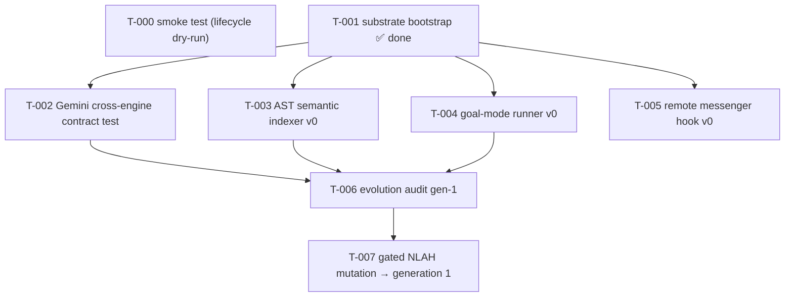

# ORCHESTRATION.md — Delegation Topology of the Universal Agent Harness

> **Resumen en español**: ni paralelismo caótico ni una cascada gigante. La delegación se
> modela como un **grafo de dependencias (DAG)**: la cascada existe exactamente donde hay
> una dependencia real de artefactos (el claim se rechaza si los `depends_on` no están
> `done`), y todo lo demás corre en paralelo bajo locks con TTL y claims con lease, para
> que ningún agente atascado detenga al resto. Productor ≠ aprobador, siempre.

This document is the shared topology contract for every engine (Claude, Gemini, human).
The NLAHs (`claude.md`, `gemini.md`) define *how each engine behaves*; this file defines
*how work flows between them*. The substrate reference is [.harness/README.md](.harness/README.md).

---

## 1. The false dichotomy (read this first)

Two failure modes motivated this design:

- **Unmanaged parallelism** (the observed problem): agents run concurrently with no shared
  task index, no ownership, no dependency gates and no hand-off ritual — so they duplicate
  work, overwrite each other, and nobody delegates.
- **The giant cascade** (the tempting fix): one long delegation chain A→B→C→…→N. It trades
  chaos for fragility: every hop adds latency and context loss, and one stalled link halts
  the entire pipeline — Tomašev's *serial stagnation* critique (research digest §3A).

The resolution: **delegation is a property of the task graph, not of the org chart.**

1. Work is decomposed into tasks with `depends_on` edges — an edge exists **only** when a
   task literally consumes another task's artifact.
2. **Cascade where real**: `blackboard.py claim` mechanically refuses any task whose
   dependencies are not `done`. Delegation chains are enforced by data, not politeness.
3. **Parallel where possible**: everything on the unblocked frontier can be claimed
   concurrently by different agents. Collisions are prevented by claims (task ownership)
   and TTL write locks (file ownership).
4. **Nothing stalls**: claims carry leases, locks carry TTLs; both auto-expire and release,
   so a crashed or looping agent returns its work to the pool instead of blocking the DAG.

## 2. The lifecycle (identical for every engine)

```
open ──claim──▶ claimed ──update──▶ in_progress ──handoff──▶ review ──verdict──▶ done
  ▲                                     │                        │
  └───────── lease expiry / REJECTED ◀──┴── blocked ◀────────────┘        failed = abandoned
```

| Step | Command |
|---|---|
| See the board | `python3 .harness/bin/blackboard.py status` |
| Get dispatched | `python3 .harness/bin/blackboard.py next --agent <you> [--role r] [--engine e]` |
| Claim (cascade-gated) | `python3 .harness/bin/blackboard.py claim <T-ID> --agent <you>` |
| Lock each file you'll edit | `python3 .harness/bin/lock.py acquire <path> --holder <you> --task <T-ID>` |
| Announce | `blackboard.py update <T-ID> --status in_progress --note "plan: ..."` |
| Record artifacts/notes | `blackboard.py update <T-ID> --artifact <path>` / `--note "expected X, got Y"` |
| Hand off (never self-approve) | `blackboard.py handoff <T-ID> --to-role verifier --note "<replayable evidence>"` |
| Verdict (verifier only) | `blackboard.py update <T-ID> --status done` or `--status open --note "REJECTED: ..."` |
| Release locks | `python3 .harness/bin/lock.py release <path> --holder <you>` |

**Note taxonomy (U2)**: task notes SHOULD be prefixed with one of four tags so evolution
audits can `grep` them mechanically instead of re-reading prose:

| Prefix | Use for |
|---|---|
| `DECISION:` | A choice was made where more than one valid option existed |
| `DEVIATION:` | Work diverged from the plan/spec (disclose it, don't hide it) |
| `TRADEOFF:` | A benefit was traded for a cost (perf vs. simplicity, coverage vs. speed, …) |
| `OPEN-QUESTION:` | An unresolved ambiguity for the join or the next audit to chase |

Evolution audits (§6) count and chase every `OPEN-QUESTION:` note to closure before a
generation is declared clean (`audit_gen3.md` §5.7, input U2 — `state.json:356`).

## 3. Invariants and the risks they neutralize

| Invariant | Mechanism | Risk neutralized (digest §3A) |
|---|---|---|
| Single guarded index | Only `blackboard.py` writes `blackboard.json`, serialized by flock | Write collisions on shared state |
| Cascade gate | `claim` refuses unmet `depends_on` | Chaotic parallelism / premature work |
| Leases + TTLs | Claims and locks auto-expire; sweeps release them | Serial stagnation, agentic traps (infinite loops holding resources) |
| Producer ≠ approver | Workers can only `handoff`; a different agent verdicts | Cognitive monoculture, self-graded homework |
| Replay, don't trust | Verifiers re-run hand-off commands themselves | Dynamic cloaking (falsified logs) |
| Human gates | `state.json human_gates` list (push, NLAH mutation, webhooks, deletions) | Automation bias |
| Bounded everything | `state.json limits` (steps, retries, timeouts, fan-out) | Runaway loops, rate-limit burn |
| Hook-fed logging | PostToolUse hook appends tool calls to `transcript.jsonl` in sessions rooted in this repo; `events.jsonl` (CLI-written) is the engine-agnostic floor | Unobservable trajectories (no evolution evidence) |

**Pre-gate ritual (U4)**: before any heavyweight human gate fires (first `git push`, first
messenger/notify activation), the epic join MUST produce an explainer artifact plus exactly
3 comprehension questions for the human, and the gate request cites them — "no publicar lo
que no se entiende" (`audit_gen3.md` §5.7, input U4 — `state.json:358`; worked example:
`docs/harness-explainer.html` §11 "Unknowns").

## 4. Roles and engines

**Roles** (claude.md §2B): `thinker` (plans, decomposes, audits — no source edits),
`worker` (claims, locks, implements, hands off), `verifier` (replays, verdicts, sweeps).
**Coordinator** (main session, strongest available model): decomposes goals into the DAG (or delegates that to the
planner), dispatches the frontier, synthesizes at joins, governs evolution. The
coordinator does not hog worker tasks on multi-task builds.

**Verifier rotation (F6)**: no single reviewer identity may be the sole approver of an
entire epic. Epic joins and guardrail changes require a reviewer distinct from every
producer in the epic — rotate identities or bring in a second reviewer with a different
lens. Precedent this codifies: T-031's guardrail was verdicted by a rotated `verifier-b`
(`events.jsonl:585`) and T-032/T-033 rotated in `verifier-c`. Counter-example this rule
forecloses: the mdtoc epic (T-021..T-029), where a single `harness-verifier` identity
claimed and approved all 9 producer tasks (`events.jsonl:312-481`) — exactly the
monoculture risk the §5A loop flagged (`audit_gen3.md` §4 row F6, input `state.json:352`).

**The bench** (`.claude/agents/` — mesa de internos): `orchestration-planner` (thinker),
`substrate-worker` (worker), `harness-verifier` (verifier), `evolution-analyst`
(thinker, §5A loop), `research-librarian` (thinker, corpus grounding). Capability
contracts and reputation live in `state.json agents`.

**Engine routing**: `claude` for judgment, synthesis, architecture; `gemini` for
million-token digestion, heavy Python math, plotting. Gemini is reached through the
**prompt bridge**: the coordinator writes a numbered, self-contained prompt in
`prompts para Gemini/` (`1.md`, `2.md`, …), the human pastes it into Antigravity, and
the outputs come back into the blackboard. The coordinator NEVER simulates Gemini's
execution. Tasks tagged `--engine gemini` wait for the bridge.

**Deployment modes** — the substrate is file-based, so both work identically:
- *In-session fan-out*: the coordinator spawns bench agents in parallel over the frontier.
- *Multi-session swarm*: several terminals/machines/engines, each exporting its own
  `CLAUDE_HARNESS_AGENT_ID`. Claude Code sessions get mechanical lock enforcement via
  hooks; other engines follow the CLI protocol per their NLAH.

## 5. Topology patterns

- **Fan-out / join**: default. Independent siblings in parallel; a join task
  (`depends_on` all siblings) integrates and verifies.
- **Tournament / consensus** (Co-Scientist): for high-uncertainty nodes, publish N
  parallel candidate tasks with different approaches, then one verifier task compares
  and picks. Prefer diversity of method over redundancy of the same method.
- **Market-lite dispatch**: `blackboard.py next` is a greedy dispatcher (priority, then
  id) filtered by role/engine — a minimal stand-in for bid/auction protocols until
  reputation data (state.json) justifies smarter assignment.

## 6. Governance: evolving the harness itself

`claude.md` and `gemini.md` are mutable **only** through the §5A loop:
logs → audit with quoted evidence (`evolution-analyst`) → proposals in
`state.json evolution.pending_proposals` → **human approval** (human_gates) → gated apply
+ re-verification → `harness_generation` bump + git commit. Generation 0 was committed at
bootstrap; every accepted mutation is a new generation and a new commit (rollback = revert).

## 7. The seeded DAG (generation 0)



T-002/T-003/T-004/T-005 are the parallel frontier (no edges between them — no shared
artifacts). T-006 is a real join: the audit consumes their logs. T-007 is a real cascade:
mutations require the audit's verdicts. That is the whole philosophy in one picture.
